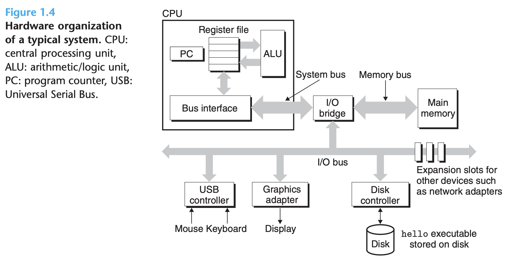
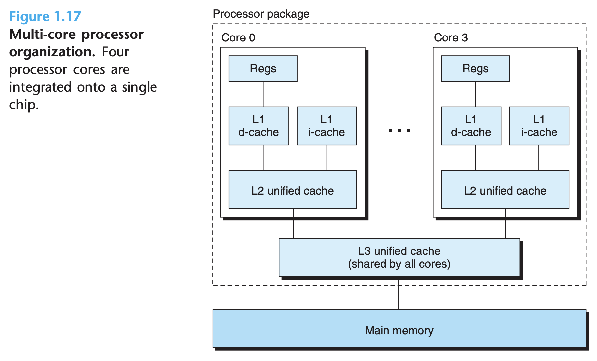
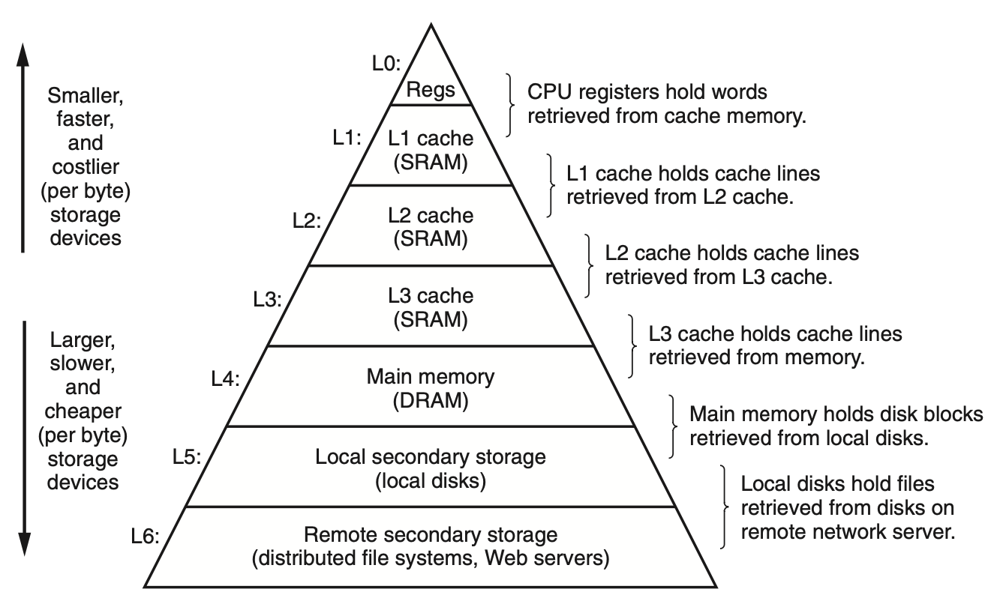
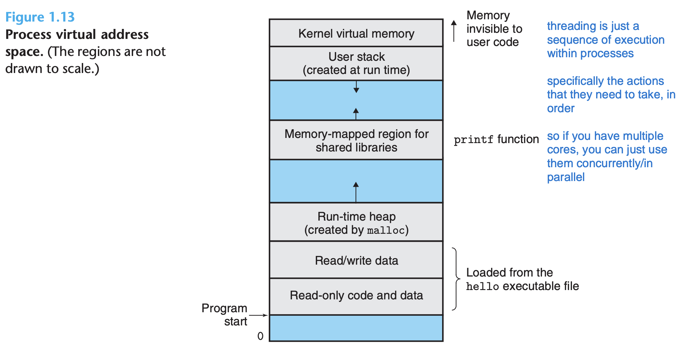

# Chapter 1: A Tour of Computer Systems

## Compiler 
* Preprocessor -> Complier -> Assembler -> Linker
    * Preprocessor takes header files and sticks them into the program as well
    * Compiler translates the file into assembly (depends on the device ofc) 
    * Assembler translates the previous output into a binary that encodes the instructions for main as machine code, not an executable (.o)
    * Linker links the program to the standard C library? and outputs and executables program 
* Assembly language is useful because it provides a common output language for different compilers for different high-level languages.
* Packages them in a form known as a relocatable object program, and stores the result in the object file hello.o
* The printf function resides in a separate precompiled object file called printf.o 
* We can rely on the compilation system to produce correct and efficient machine code
 
> some engineers just make compilers, to be better suited for their use cases
> understanding the process gives you greater control and understanding of how programs should be written; shit like why passing by reference is slower than a local variable
> get better at C bitch

## Processors, instructions, memory
* Shell is a command-line interpreter that prints a prompt, waits for you to type a command line, and then performs the command
* Buses: basic stuff, but what about the word sizes? just chunks that it can send?
* Each I/O device is connected to the I/O bus by either a controller or an adapter; and then you have the things that IO devices connect to and the drivers that determine the communication between CPU and IO device
* DRAM: Dynamic Random Access Memory
* SRAM: Static Random Access Memory

### Main memory
* Logically, memory is organized as a linear array of bytes, each with its own unique address (array index) starting at zero

### Processor
* A processor appears to operate according to a very simple instruction execution model, defined by its instruction set architecture
* x86, MIPS, etc

### CPU architecture: 
* Program counter: contains address of a machine-level instruction
* Register file: collection of word-sized registers that hold things for the ALU
* ALU: computes new data and address values
* The ALU computes new data and address values.
* ISA ≠ microarchitecture (how the processor hardware is implement) 

### Processor
* DMA: data travels directly from disk to main memory, without passing through the processor
* oh nah it's the executable that gets piped

### Cache
* A system spends a lot of time moving information from one place to another; most of the copying is the overhead that slows down real work
* Larger storage devices are slower than smaller storage devices
* 5 times longer for the processor to access the L2 cache than the L1 cache, but still 5 to 10 times faster than accessing the main memory
* caches exploit locality - holding data in a place so it's much faster
* low level languages with more control let you exploit this advantage

> If you know how to work with this you can speed up programs a lot

Dynamic Random Access Memory (DRAM):  
- needs constant refreshing
- higher density than SRAM
- Main memory

Static Random Access Memory (SRAM): 
- L1 and L2 cache
- flip-flops to store data (flip flops are like redstone switches, can store one bit of info until changed again)
- faster, but lower density and higher power consumption

* cache hierarchy is good for speed control and optimizing performance
* kind of like cabinet shelving or supermarket planning

### Storage
* L3 is cache for the main memory
* L1&2 are caches for L3 
* L3 is on chip, but slower and shared amongst all processors
* L2 contains instructions and data
* L1 is closest to CPU, split into instruction cache and data cache
* Caches L1 and L2 are caches for L2 and L3;  L3 cache is a cache for the main memory

## OS
### Purpose
1. protect the hardware from misuse by runaway applications
2. provide applications with simple and uniform mechanisms for manipulating complicated and often wildly different low-level hardware devices

> layer between user apps and the hardware itself, abstracts a lot of things away and has processes that determine how the hardware is accessed/used

### Processes
* A process is the operating system’s abstraction for a running program
* Concurrently means one process interleaved with another (like sub-processes, mkdir on one and jump on another and sll on another) 
* Operating system keeps track of all the state information that the process needs in order to run. This state, which is known as the context
* Context switch by saving the context of current process, restoring the context of new process
* Running a program uses a syscall

> kernel is part of os that handles all the syscalls and controlling stuff
> also does everything else and executes whatever the os decides

* threading is just a sequence of execution within processes
* specifically the actions that they need to take, in order
* so if you have multiple cores, you can just use them concurrently/in parallel

### Virtual memory
* address space, holding code and data
* this is for a program
* used as an abstraction (so programmers don't need to care about actual memory layout), extending memory (swap), isolating processes, allows sharing
* it itself is a memory management technique
* So instead of actually seeing the memory, you have the same 'template' of virtual memory that everyone sees and is identical across devices
* the VMEM itself is a bunch of well-defined areas with specific purposes each. More on that later

swaps are part of it:
1. program code and data
2. heap for adding bits
3. shared libraries (header files)
4. stack: executing function calls
5. kernel vmem: only kernel allowed

### Files
A file is a sequence of bytes. 

### Networking
* Can just be viewed as an I/O device
* System can read data sent from other macines and copy these data to its main memory 
* keyboard -> network to server -> server to shell -> shell to client over network -> client display
* Suppose we use a telnet client running on our local machine to connect to a telnet server on a remote machine

## Amdahl's Law
* So basically giving points to each part, and representing each part as a percentage, and the final score as the sum of percentage x score. 
* The main idea is that when we speed up one part of a system, the effect on the overall system performance depends on both how significant this part was and how much it sped up

## Concurrency and parallelism
* concurrency = how to multitask; parallelism = the act of multitasking
* systems where multiple programs execute at the same time, leading to concurrency
* concurrent execution was only simulated, by having a single computer rapidly switch among its executing processes, much as a juggler keeps multiple balls flying through the air
* Hyperthreading, sometimes called simultaneous multi-threading, is a technique that allows a single CPU to execute multiple flows of control. It involves having multiple copies of some of the CPU hardware

> yeah scheduling and process handling and all that. threads help a lot with concurrency.

* It enables the CPU to take better advantage of its processing resources
* The use of multiprocessing can improve system performance in two ways
* Reduces the need to simulate concurrency when performing multiple tasks

### Instruction level parallelism
* instruction level parallelism: executing multiple instructions at the same time, how?
    * oh che it's using different stages of each instruction
* so parts of each thread
* like malloc on one, print on another, execute, etc
* Processors that can sustain execution rates faster than 1 instruction per cycle are known assuperscalar processors

### SIMD Single Instruction Multiple Data Parallelism
> shortcuts/macros for hardware
* Instructions
* On the processor side, the instruction set architecture provides an abstraction of the actual processor hardware
* The underlying hardware is far more elaborate, executing multiple instructions in parallel

> abstractions let ideas be transferable across machines until a paradigm shift occurs

## Summary
1. files are abstractions for IO
2. vmem is an abstraction for main mem and disks
3. processes are abstractions for the processor, main memory, and IO devices
