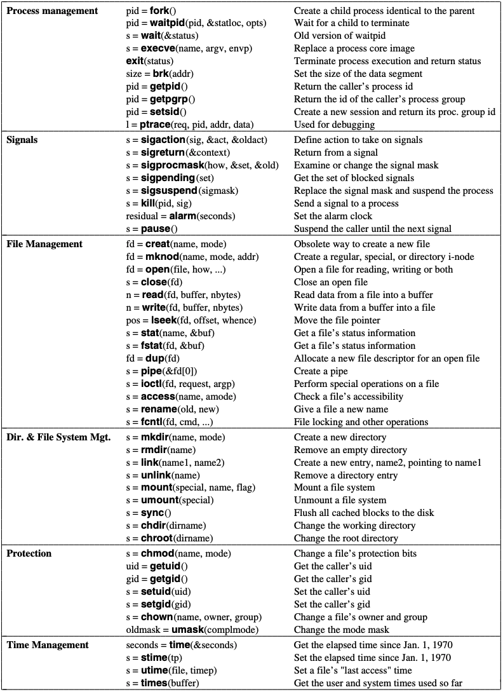
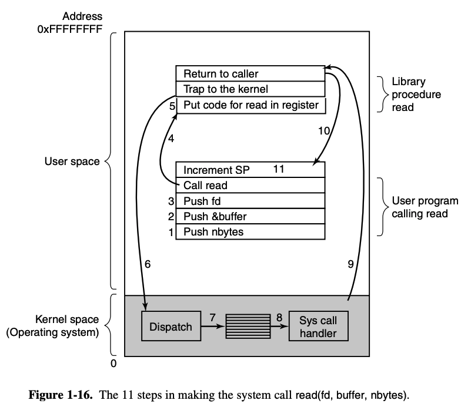
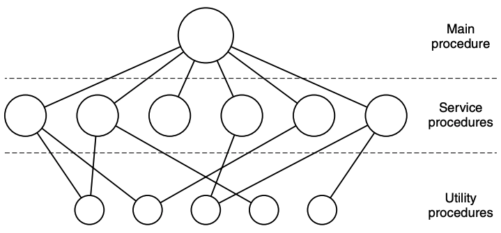
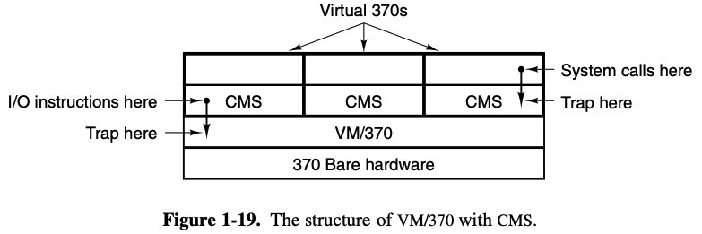

# Chapter 1 notes

* Apps -> System programs (compilers, editors, command interpreter) -> OS -> Machine code -> Microarchitecture (CPU,  ALU, etc) -> Physical devices
* Instructions + hardware = Instruction set architecture (ISA), or *machine language*
* An OS abstracts away the details of moving data, finding heads, etc for the programmer
* OS typically runs in **kernel mode** or **supervisor mode** to prevent users tampering with hardware

> the OS can be seen as an extension of the computer, or as a resource allocator (generally both makes sense)

Multiprogramming: partitioning memory to handle multiple jobs at the same time

## History of computing/OS: PC generation
* Microprocessor based
* 8080: first general purpose 8-bit microprocessor
* 6502: CPU of early systems, most notably the Apple II
* Doug Engelbart: invented GUI

## MINIX 3
* Modded UNIX - OS that's compatible with UNIX, but different internally
* Mini UNIX
* Spawned Linux

Processes:
* Program execution
* Each process is associated with an **address space**, a list of memory locations which the process can rw
* Child processes -> tree structure; related processes require cooperation and synchronization
* After *n* seconds the OS sends an alamr signal to the process, causes temporary halting and saving registers on the stack
* Signals are the software analog of hardware analogs


Files:
* Directory structure
* Very familiar with trees after my job :)
* (this is more a thing with the fact that it's old but interesting regardless) MINIX 3 allows CD-ROMs to attach their file system to the main file tree
* Special files: 
    * **Block special files**: used to model devices that consist of a collection of randomly addressable blocks (e.g disks)
    * If you open a block special file and read a block, the program can access that block without regard to the file system contained within
    * **Character special files**: model printers, modems, devices that IO character streams. kept in /dev by convention.

Shell
* "makes heavy use of many OS features and thus serves as a good example of how the system calls can be used."
* sh -> csh, ksh, zsh, bash
* Just read about UNIX bro ~ Tanenbaum 


### System calls
* Interface between applications and the OS
* POSIX = set of standards 
* Whenever a program wants to do something (e.g move a file) it makes a system call
* The OS figures out what the program wants by inspecting the parameters, carries out the call, and return control to the instruction following the call
* Only system calls enter the kernel or other privileged OS components and procedure calls don't
* MINIX 3 has 53 main system calls

System calls for process management:
* Fork is the only way to create a new process, and it creates an identical copy that diverges the moment they split
* Fork call returns a value - zero in child and the child's process identifier (**PID**)
* Since most child processes are run synchronously with their parents the parents execute a **waitpid** system call to wait for the child to terminate
    * when it's done the address pointed to by the second parameter, **statloc** will be set to the child's exit status 
* execve is used to execute the user command

```
/* this code demonstrates how fork, waitpid, and execve can be used */
#define TRUE 1

while (TRUE) {
    type_prompt();
    read_command(command, parameters);

    if (fork() != 0) {
        waitpid(-1,&status, 0);
    } else {
        execve(command, paramters, 0);
    }
}
``` 
For some reason the processes are usually forked:
* Creates a child process, so the command can be executed in a process separate to the shell's process
* Preserves the shell's state
* Concurrency
* Resource managed better
* That's the reason that commands such as (cp file1 file2) are forked 

### Main system calls of MINIX:
 

Programs of system calls:
* use the declaration main(argc, argv, envp)
* argc counts the no. arguments
* argv is a pointer to an array containing the strings inputted in the command
* envp is a pointer to the environment, pass information of the env (e.g terminal type, home directory) to the program
* & is used to obtain the memory location - e.g n = waitpid(−1, &statloc, options); the &statloc provides the memory address of the statloc variable to waitpid()

Processes:
* 3 segments: text, data, and stack
* Data goes up, stack goes down, gap is unused address space
* Stack grows into gap automatically, expansion of data is done explicitly by a system call **brk** which specifies the new address where the data segment is to end.
* Stack and data cannot overlap
* sbrk does the same thing but changes the size of the data segment - it keeps track of the current size, getting the new size, and making a call for that many bytes

System calls for signalling
* To handle unexpected communications (e.g interrupts (CTRL-C) to halt programs)
* Interrupts to make sure a program does something (e.g retransmit lost packets over a network)
* Also processes that get activated by signals

### System calls for file management:
* For some reason named creat and not create
* Parameters provide name of file and protection mode (e.g `fd = creat("filename", 0751)`)
* Mode = flags that determine the perms and access for the file
* Octal notation = 3 digit number - [0] represents permissions for the owner, [1] represents the permissions for the group associated, [2] represents the permissions of everyone else
* Special files are called with mknod(path, octal, major device) instead
* Read and write have various modes (like the Google Drive API)
* Some programs need to be able to access any part of a file at random; **lseek** used for that purpose

|Digit | Permissions|
|-|-|
|0 (000 in binary)| No permissions|
|1 (001 in binary)| Execute permission|
|2 (010 in binary)| Write permission|
|3 (011 in binary)| Write and execute permissions|
|4 (100 in binary)| Read permission|
|5 (101 in binary)| Read and execute permissions|
|6 (110 in binary)| Read and write permissions|
|7 (111 in binary)| Read, write, and execute permissions|

0751 means the owner has full permissions, the group associated can read and execute it, and everyone else can execute it

Terminal modes:
* Cooked, raw and cbreak
* Cooked = normal model, erase and kill characters work normally, CTRL commands work as usual
* Raw = all commands disabled; displays all the characters that have been typed and not just completed lines, used for visual editors
* cbreak = in between; kill and erase characters for editing are disabled but CTRL commands work
* In POSIX, canonical mode = cooked mode; in noncanonical mode the input is not processed line by line but the program can specify a minimum no. characters to accept or a timeout before satisfying a read request 
    * Read request is the system call to read a file

### System calls for directory management:
* Relating directories/file system as a whole
* mkdir and rmdir falls under this category
* **link** allows the same file to appear under 2 or more names, in different directories. Usually used by programming teams.
    * Every file has a unique i-number identifier
    * If you ` link("dir/a/file.file", "dir/b/filename.file") `, you get both file.file and filename.file linking to the same file 
    * Like a fortnite skin - skin changes, player stays the same 
* **mount**, as you probably know by now, slaps a file system onto another so they're connected via that node. mount("dev/sda3", "/mnt", 0)
* Block cache: cache of recently used blocks so you can reuse them quickly.
* **chdir** and **chroot**: changes working directory, like cd; changes root directory
    * Server programs do this to limit access by remote users

### System calls for protection:
* Limiting access through commands such as chmod or mkdir
* Permissions handled through user id (UID)

## OS Structure
1. Monolithic systems
2. Layered systems
3. VMs
4. Exokernels
5. Client-server systems

### Monolithic
* Collection of procedures, no structure
* Each procedure has a well-defined interface of parameters and results; can call each other
* The little structure that's possible is achieved by putting parameters in well-defined places (e.g registers or in the stack), then executing a special trap instruction known as the kernel call/supervisor call
    * Stack = memory kind of stack
    * Trap instruction = transitions from user mode to kernel mode, allows users to requests services from the OS kernel
    * Kernel mode - all instructions are allowed; user mode - IO and certain other other instructions are not allowed



System calls (e.g read(fd, buffer, nbytes)):
1. Push nbytes
2. Push &buffer (memory location of the buffer) (calling by reference)
3. Push fd 
> C and C++ compilers push the paramters on to the stack in reverse order
4. Make actual call to library procedure
5. Library procedure places system call in a place where OS expects it
6. TRAP instruction -> switches from user mode to kernel mode, starts execution at fixed address
7. Kernel code examines system call number, dispatches to corresponding system call handler (via pointers indexed on system call number)
8. System call handler runs
9. TRAP instruction used to return to user mode, control returned to user-space library procedure
10. Returns to user program in the usual way procedure calls return
11. Clean up stack -> removes pointer of parameters pushed before call

> At step 9 the system can block the call if needed (e.g reading keyboard input but nothing has been typed)

 

### Layered Systems

Layers of Dijkstra's THE operating system:
0. Processor allocation and multiprocessing
1. Memory and drum management (drum is rotary magnetic storage device, obselete)
2. Operator-process communication
3. I/O management
4. User programs
5. The operator  

### VMs

* Identical to true hardware
* Loading an OS onto VM address space 

### Exokernels
* Allocates resources to VMs and checks attempts to use them so nobody is using another machine's allocated resources
* Saves a layer of mapping: each VM thinks it has its own disk, but it's the partitioned space provided by the exokernel

### Client-server model
* Moving code to higher layers so the kernel is distilled to the absolute minimum
* Services obtained by sending messages to server processes
* Used in distributed systems -> regardless of if it's a VM or a server across a network, message out reply back

So basically an OS is these 4 things:
1. File management
2. Process management
3. Memory management
4. I/O device management

A handful of system calls dictate what the OS can do. MINIX has 6 groups:
1. Process creation/termination
2. Signal handling
3. RW files
4. Directory management
5. Protects information
6. Keeping track of time


