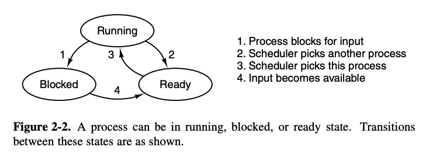
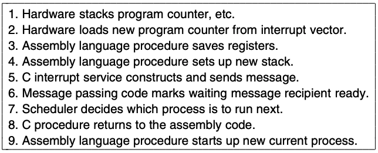
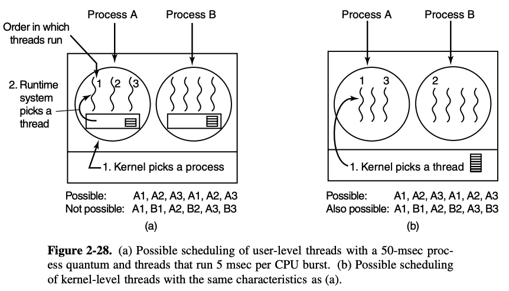
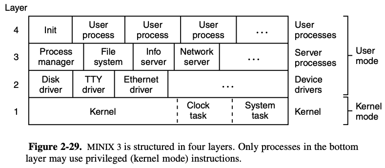
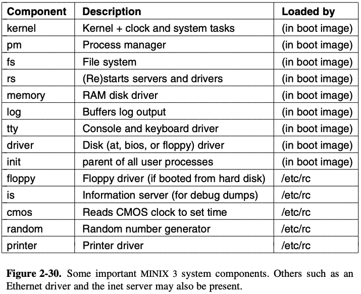

# Chapter 2: Processes
> Abstractions for running a program

## Process model
* Multiprogramming: switching processes very fast to give the illusion of parallelism
* Multiprocessing: having multiple cores running multiple threads at any one time
* Generally processes are sequential, only one program is running

### Process creation
1. System initialization
2. Execution of process creation system call by a running process
3. User request to create new process
4. Initiation of batch job

Foreground process = interacts with users; background process = have a specific function (e.g receiving requests for a website hosted locally) (daemons)
* Processes break down their task into smaller, more manageable processes
* **fork** clones processes, parent and child have the same memory image, environment strings and open files
    * Usually the child executes execve to cahnge the image and run a new program

### Process termination
1. Normal exit
2. Error exit
3. Fatal error
4. Killed by another process

Fatal error: big errors that make the program crash immediately (e.g compiling a file that doesn't exist)

### Process states
* Piping processes and programs
* Processes can be in 3 states: running, blocked, and ready 



* Transition 1 occurs when a process discovers it can't continue. Sometimes a system call needs to be executed to get into blocked state
* Transition 2 and 3 are caused by the process scheduler - part of the OS - without the process even knowing
    * 2 occurs when the scheduler decides "yep that's been long enough you go away"
    * 3 occurs on the other side of that
* Transition 4 occurs when an external event that a process is waiting for occurs (e.g keyboard input)
 
### Implementation of processes
* OS has a process table, with one entry/process
* Contains information on the process' state, program counter, stack pointer, memory allocation, status of open files, accounting and scheduling information, alarms and other signals; everything about the process must be saved when the process is switched from running to ready


Associated with each IO device class is an **interrupt descriptor table**, and the key part of each entry is the **interrupt vector** which contains the address of the interrupt service procedure. So if process 3 is running when the interrupt occurs, everything in the block is pushed onto the stack, and the computer jumps to the address specified by the IV.

### Threads


* A process is a way to group related resources together to be managed more easily (open files, child processes, signal handlers, etc)
* A thread of execution has a program counter that keeps track of the instructions to execute, and registers to hold the current working variables
* Multiple threads allow multiple executions to take the same place independently

|Per process items|Per thread items|
|-|-|
|Address space|Program counter|
|Global variables|Registers|
|Open files|Stack|
|Child processes|State|
|Pending alarms||
|Signals and signal handlers||
|Accounting information||

Switching threads is much faster when management is done in user space than when system calls are made. Thus, the kernel has a thread table to list all the threads in the system to schedule.
* In the user space, the thread chooses its successor before it blocks
* Otherwise, the OS chooses which one to run via a system call

Handling the errors and memory allocation while switching threads is done by the OS. 

When stack overflow occurs, the kernel provides more stack; in multiple threads, the kernel may not be aware of all these stacks and not grow them as needed.

## Interprocess communication
How processes talk to other processes
1. Passing information from one process to another 
2. Ensuring synchronicity and that they don't block one another
3. Properly sequencing dependencies and doing things in the right order (e.g printing grepped info)

Race conditions:
* Processes may share a common storage from which they read and write
* Situations where the final results depends on which process runs precisely when are called race conditions
* If an interrupt occurs on a process A while it's running and process B continues, but when it flips back process A continues where it left off and overwrites what B did B will be stuck forever. Rare, but it happens.

Avoiding race conditions:
* **Mutual exclusion**: if a program/process is using a shared variable/file, other processes are barred from doing the same
* Critical region/section: part of the program where shared memoery is accessed
* Conditions for a good solution:
    1. No two processes may be simultaneously inside their critical regions
    2. No assumptions made about the speed or no. CPUs
    3. No process running outside its critical region may block other processes
    4. No process should have to wait indefinitely/forever to enter its critical region
* Queueing works - if A is in the critical region, and B also wants to go in, it will have to wait until A is done but it can immediately enter afterwards

Mutual exclusion with busy wating - ways to achieve mutual exclusion:
* Disabling interrupts: disabling all interrups when it enters the critical region and enabling it just before it leaves again - not very good, processes might turn them off and never switch them back on
* Lock variables: basically setting a variable to true and waiting for it to turn false to enter the critical process - flawed because if it didn't set in time because of some CPU bug, then it overwrites and a process is stuck with nothing
* Strict alternation: same thing, keeps testing the variable until it turns (busy waiting) but it fails the 3rd condition described above
* Peterson's solution: like strict alternation, but safer and sets departure internally 
* TSL (test and set lock) instrction: TSL instruction locks the memory bus until lock is set back to 0, hardware solution

Sleep and wakeup: Instead of constantly refreshing to see if the variable changed, you suspend a process until another process wakes it up

Producer-consumer problem: 
* Producers put information into the buffer, consumers take it out
* Problem occurs when the buffer is already full or is empty -> producer sleeps or consumer sleeps
* Might lead to race conditions
* Use a variable counter to keep track of items in the buffer
* Wakeup waiting bit keeps track of the process' status; but in multiple processes it isn't enough

Semaphores:
* Variable type to count the no. wakeups saved for future use
* Operations up and down (generalization of wakeup and sleep) 
* Up increases the semaphore, down does the reverse
* Interrupts can be disabled as processes are only a few instructions
* 3 semaphores: one used to count the no. full variable slots, another used to count the no. empty slots, and another to ensure the producer and consumer doesn't access the slots at the same time (full, empty, mutex)

```
#define N 100 /* number of slots in the buffer */
typedef int semaphore; /* semaphores are a special kind of int */
semaphore mutex = 1; /* controls access to critical region */
semaphore empty = N; /* counts empty buffer slots */
semaphore full = 0; /* counts full buffer slots */

void producer(void)
{
    int item;

    while (TRUE) { /* TRUE is the constant 1 */
        item = produceitem( ); /* generate something to put in buffer */
        down(&empty); /* decrement empty count */
        down(&mutex); /* enter critical region */
        insertitem(item); /* put new item in buffer */
        up(&mutex); /* leave critical region */
        up(&full); /* increment count of full slots */
    }
}
void consumer(void)
{
    int item;

    while (TRUE) { /* infinite loop */
        down(&full); /* decrement full count */
        down(&mutex); /* enter critical region */
        item = removeitem( ); /* take item from buffer */
        up(&mutex); /* leave critical region */
        up(&empty); /* increment count of empty slots */
        consumeitem(item); /* do something with the item */
    }
}
```

Mutexes:
* Used when a semaphore's count function is not needed
* Can be in 2 states: locked/unlocked
* When a process needs access to a critical region, it calls *mutex_lock* (and *mutex_unlock for vice versa*)

Monitors:
* Order of actions matter a lot
    * e.g if you did a down on mutex before empty and mutex was decremented, and the buffer was completely full, the producer would block with mutex set to 0
    * Next time the consumer tried to access the buffer it would do a down on mutex - 0 - and block too
    * Now both of them are blocked and everything is in a **deadlock** and nobody is happy
* Hansen and Hoare proposed a higher level synchronization primitive called a **monitor**
    * Collection of procedures, variables, data structures all grouped together in a module/package
    * Processes can call the procedures in the monitor whenever, but they can't access the internal data structures from the procedures declared outside the monitor
    * Only one process can be active in a monitor at any instant
    * So basically they help with mutex, a lot
* To let processes block when they cannot proceed, we use **condition variables**
    * Changing 1's to 0's and 0's to 1's like switches, and when they're switched the counterpart is awoken

By putting semaphores into shared memory and protecting them with TSL instructions we can avoid races; but this doesn't work when we get to mutliple CPUs. We need a way to communicate between cores.

### Message Passing
* send(destination, &message) - again, we send the message location rather than the message itself. More efficient that way.
* Classic acknowledgement, authentication, and verification things
* Producer-consumer problem with message passing:
    * If the producer is faster than the consumer, messages end up full, waiting for the consumer; producer gets blocked waiting for *empty* to come back. 
    * Reverse happens if consumer is faster
    * One way to address this is through **mailboxes**, data structures that hold *n* messages as a buffer (specified upon creation)
    * Either the mailbox holds all the messages or it does a **rendezvous** strategy: controlling what goes out, when. If *send* is done before *receive*, *send* is blocked before *receive* happens
* Interprocess communication happens with | which are essentially mailboxes 


## Classical problems
Fork problem: 
* Like Funny Valentine napkin, but you want two napkins (one from either side). How do you take turns effectively? 
* Use mutexes to synchronize who gets to eat, who wants to eat, and verifying you actually put down the fork (who knows? you might be hallucinating) and leaving the critical region (up mutex)
* Use an array of semaphores to deal with parallelism (on a table of 5, 2 should be able to eat at any one time)

Readers/writers problem: 
* Database where n number of people can read it, but when someone is writing, only they have rw access
* Suspend all queued readers behind writer when writer is queued so writer can write

## Scheduling
Deciding which program to run on the CPU, and for how long.
* Processes can be **compute bound** or **IO bound** 
* Compute bound processes tend to have longer CPU bursts and IO shorter (but with more IO waits)
    * Like rendering images vs typing on the keyboard

Scheduling is absolutely required when 1) a process exits and 2) when a process blocks on I/O or a semaphore

It is NOT absolutely required when 1) a new process is created, 2) when an interrupt occurs, or 3) when a clock interrupt occurs (usually done though)

A non-preemptive scheduling algorithm picks the process to run until it blocks; a preemptive scheduling algorithm picks the process and lets it runs for some fixed tiem, suspends it when time's up, and picks another process to run. Only possible if the CPU has a clock.

Categories of scheduling algorithms:
1. Batch
2. Interactive: pre-emption necessary to prevent CPU hogging
3. Real time

Goals of scheduling algorithms:
* General
    * Fairness of CPU allocation
    * Policy enforcement
    * Keeping all parts of the system busy
* Batch systems
    * Maximize jobs/hour
    * Minimize time between submission and termination (speed of job completion)
    * Maximize CPU usage
* Interactive
    * Respond to requests fast
    * Meets user expectations (how long atask is expected to complete, downloading 500GB takes longer than refreshing a webpage)
* Real time
    * Avoid losing data (e.g controlling devices that produce data, missing the timing means losing data)
    * Avoid quality degradation (e.g video streaming)

### Batch scheduling
First come first served:
* Single queue
* When a process blocks, the first process in the queue runs; when it unblocks, it's put at the end of the queue
* If there's compute bound processes that runs for 1s and many IO processes that use very little CPU time but runs 1000 times, the CB process will stall the 1000 calls 

Shortest job first: 
* Tackling the easiest first to optimize for no. completions

Shortest remaining time first: 
* Same thing, but choosing the job with the least remaining time

Three-level scheduling:
* Admission scheduler decides which jobs in the input queue gets admission (like a bouncer) (looks for compute-bound and IO bound jobs)
* Memory scheduler decides which processes should be kept on disk or in memory
    * Decides the kind of and no. processes in memory  - degree of multiprogramming
* CPU scheduler decides which ones gets processed and maximize CPU usage
    * Any algorithm can be used here 

Criteria for decisions:
1. Time since last swap
2. CPU time given to a particular process
3. Size of process
4. Priority/importance of a process

### Interactive scheduling
Round robin:
* Timed turns
* Very easy to implement - each process is given *n* time, swaps when time's up, so ad infinitum or until the processes are complete
* Switching takes time though, and the time/process (*quantum*) is decided based on the swap time (if the swap takes 1s and the quantum is 4s, the swap takes 20% of CPU time which is a big no no) (tradeoff since long times means processes will wait for a long time)
* 20-50msec is generally reasonable

Priority scheduling:
* Sometimes priority decay is implemented (based on time) and if the priority dips below a certain value, the next one is moved up
* Priorities can be assigned statically or dynamically
    * Static: each process is given a score (e.g for a CEO, reputation might be given 100, ground-level issues 90, future decisions 80, etc)
    * Dynamic: If a system is IO bound and doesn't take much CPU time, it can be assigned high-priority (since it completes fast) (
    * "The UNIX system has a command, nice, which allows a user to voluntarily reduce the priority of his process, in order to be nice to the other users. Nobody ever uses it."
*  Sometimes priority is classified into categories for easier management; each category has its own queue; adjusted occasionally since lower-level processes might starve

Multiple queues:
* It's more efficient to give CPU bound processes large quantum once in a while than many small ones
* So basically we're sort of switching from batched mode to interactive through decay: processes are run less frequently, with more quanta, and moves down classes every time it's completed

Shortest process next:
* Choose the shortest job 
* Decay is also used here (called aging)

Guaranteed scheduling: 
* Processes
* How much CPU each process has had since creation
* Chooses the one with the lowest ratio of given time:needed time

Lottery:
* Gambling
* Winner gets *x* amount of CPU time
* Scheduling is highly responsive, if a new process shows up the very next lottery it has a chance of winning
* Cooperating processes can share/exchange tickets if they so wish

Fair-share scheduling: 
* Allocating identical amounts of compute to each process
* More processes = user has more of the CPU (e.g user 1 has 3, user 2 has 7, then 1 gets 30% and 2 70%)

### Real time scheduling 
* When an external device generates stimuli and the computer has to react (like a keyboard? cd player is one)
* Hard real time - absolute deadlines; soft real time - occasional miss is tolerated
* Periodic or aperiodic
* A RT system that meets the criteria (sum(CPU time/periodicity) <= 1) is said to be **schedulable**
    * e.g a soft RT system with 3 periodic events, periods 100, 200, 500 msec respectively.
    * If these events require 50, 30, and 100 msec of CPU time per event the system is schedulable since 0.5 + 0.15 + 0.2 <= 1
    * RT scheduling algorithms can be static/dynamic (decisions before running, decisions while running)

Policy vs Mechanism:
* Mechanism is how the scheduling happens (e.g via system calls in some way)
* Policy is how the scheduling is decided 
* Separating the two allows the scheduler to make the best choice via accepting user inpuit

Thread scheduling:
* For multithreaded processes
* 2 levels of parallelism: processes and threads
* User level:
    * Each thread is switched internally with CPU bursts and runs process by process rather than switching threads between processes 
    * Basically a process is run until its quantum is up, and thread switching occurs internally as per the CPU time specified by the thread
* Kernel level:
    * Kernel picks a thread without considering which process it belongs to
    * Allocates quantum to threads rather than processes, forcibly stopped if the thread runs out
    * Since the kernel knows which thread belongs to which process it can account for that (switching processes is more expensive)



## Processes in MINIX 3
* UNIX is monolithic, MINIX 3 is a collection of processes that communicate with each other and with user processes
* Message passing is neede3d to make it work better

### Internal structure of MINIX


Kernel
* Roles 
    * Kernel in bottom layer schedules processes, manages transition between states; also handles interprocess messaging
    * Also supports access to the IO ports and interrupts; modern processors use privileged kernel mode instructions not available to normal processes
    * Clock task - IO device driver that interacts with the hardware (generates timing signals)
* Functions
    * Provides privileged kernel calls to the drivers and servers above 
    * RW IO, copying data between addresses, etc
    * Implementation of these calls = system tasks
* Almost entirely written in C, some assembly

User mode
* 3 layers, but can be considered one since the kernel treats them the same way
* Limited to user mode instructions, can't access IO ports directly
* Processes can potentially have special privileges, real difference between 2, 3, and 4 (2 has most, 4 has none)
* Roles
    * Layer 2: device drivers - request the system read/write data to IO ports
    * Layer 3: servers - provides services to user processes. Process manager carries out MINIX system calls involving start/stop of process execution (fork, exec, exit) and managing memory (file system read, mount, chdir)
        * Other servers exist in layer 3, performs MINIX 3 specific processes
        * Information server: handles jobs like debugging and status information about drivers and servers
        * Reincarnation servers: starts/restarts device drivers that aren't loaded into memory at the same time as the kernel. Kills it if necesary
        * Network server
    * Layer 4: system calls and user processes - shells, editors, compilers, user-written compiled C programs
        * Daemons are also in this layer (background processes, executed periodically 
* Drivers in layers 2 & 3 are referred to as **system processes**
* Device drivers are completely implemented in the user space 
 
### Process management 
Startup:
1. Boot -> looks for files in partitions, loads them into memory (kernel, process manager, file system) (**boot image**)
2. Other programs loaded onto boot image: reincarnation server, RAM disk, console, log drivers, init
3. Kernel starts system and clock tasks -> process manager and file system; then they cooperate to start other servers and drivers that are part of the boot image
4. After everything is loaded in the boot iamge has blocked will *init* execute

  

Initialization of the process tree:
1. Init: last process of the boot image; starts *service* and executes /etc/rc shell script (run commands) 
2. Service: runs as a child of init; user interface to reincarnation server, starts a all system processes (sans process manager) as its children (floppy, cmos, is (information server)) 
3. After cmos *rc* initializes the clock, checks for all the file systems, mounts them, and starts daemons
4. *init* reads /etc/ttytab, listing all the terminal devices, executes login, and executes user's shell
5. All the information is kept in the process table, which is divided amongst the kernel, process manager, and file system
> Fork and exec are the two principle processes of managing processes in MINIX 3

### Interprocess communication
* send(dest, &message)
* receive(source, &message)
* sendrec(src\_dst, &message)
* notify(dest): used when a process needs to make another aware that something important happened (nonblocking)

Notes:
* User processes can't message one another, relies on servers in layer 3 which messages drivers in layer 2
* Sender blocks until destination does *receive*
* Deadlocks can occur if two processes try to message each other at the same time; so send is restricted until it receives
* Rendezvous method used to avoid issue of buffering (receiver blocks until receive)
* Bitmap included? 

### Process scheduling
