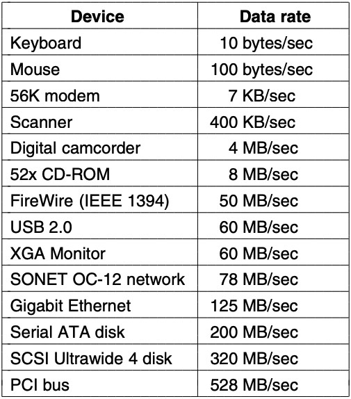
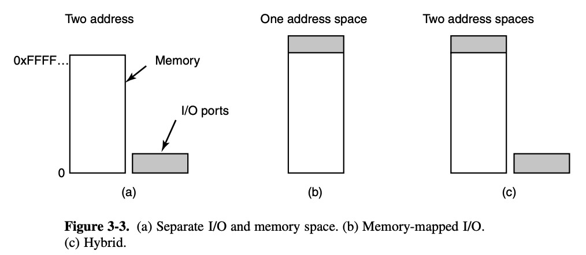
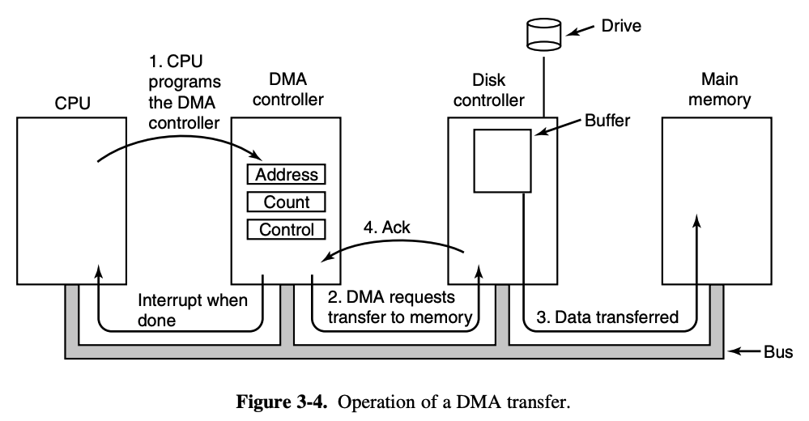
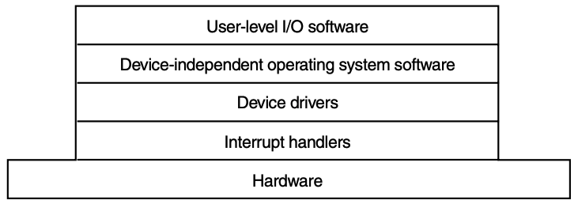
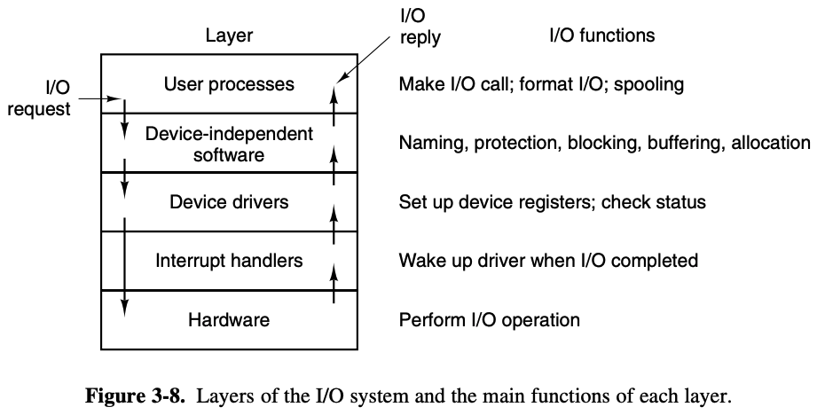
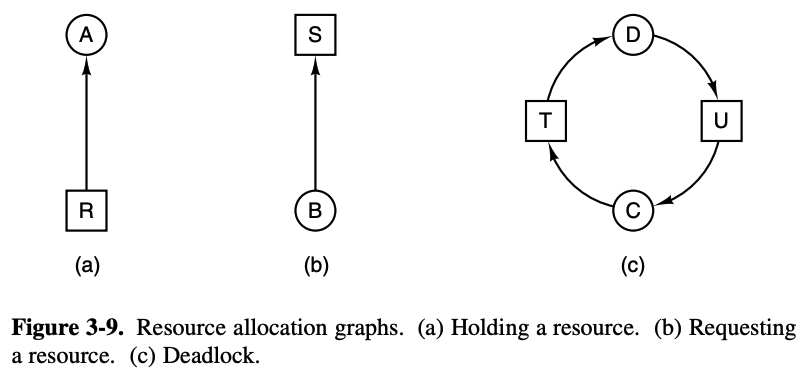
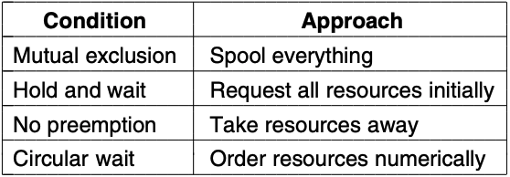

# Chapter 3: I/O
* Principles of I/O
* I/O software in general
* Deadlocks
* MINIX 3 I/O - interrupts, drivers, device-dependent I/O, devices

## Principles of I/O hardware
* Can be classified into **block devices** and **character devices**
* Block devices stores information in fixed-size blocks, each with its own address
    * Block sizes range from 512 bytes to 32768 bytes
    * Possible to rw each block independently of other ones
    * Disks are the most common
* Character devices delivers/accepts a stream of characters, without regard to any block structure
    * Not addressable
    * No **seek operation** - changing the value of the file pointer so rw operations are performed at the new location
    * Printers, network interfaces, peripherals, rats??? are character devices

### Device controllers
* Mechanical component (the device itself) + electronic component (adapter/device controller) (the PCB)
* Controller card(on the computer) has connectors which devices can be plugged (like a keyboard or mouse)
* OS almost always deals with controller, not device
* Controller and device interactions:
    * Serial bit stream
    * Preamble -> 4096 bits in a sector -> checksum (error correcting code (ECC))
    * Controller converts this stream into a block of bytes and performs any necessary error correction
    * Assemble block in buffer -> checksum verified -> copied into main memory

Memmapped I/O:
* By reading and writing to registers on the controllers, the OS can command it to deliver/accept data, turn on/off, and perform any of the available actions
* Devices have a data buffer that the OS can RW (e.g RAM)
* Two approaches to how the CPU communicates with control registers and device data buffers:
    * Control register is assigned an I/O port number (8-16 bit integer)
    * Using an instruction (*IN REG, PORT*) the CPU can read control register PORT and store in CPU register REG
    * Similar operation with (*OUT PORT, REG*)
* I/O registers are sometimes part of the regular memory address space, called **memmapped I/O** (introduced with PDP-11, the computer that Bill Gates hacked at Lakeside)
    * Each control register is assigned a unique memory address to which no memory is assigned
    * Basically partitions
    * memmap in numpy basically does this to get the address of an array in disk so it doesn't have to copy over to the buffer 

### Interrupts
* **Status bits**: test if an output is complete or if new data is available from in input
* Testing is done in loops, called **polling** or **busy waiting**
* IRQ - Interrupt Request
* Controllers tell CPUs they're ready to have their registers r/w to via interrupts too
* Input may be limited
* Some controllers are hard-wired into the parentboard (e.g IBM keyboard and disk) and the IRQ used was set by a switch associated with controller, which was annyoing, so the industry standard was standardized into a plug and play mode where the BIOS automatically assigns IRQs

### Direct memory access (DMA)
* Scheme to request a chunk/block of data from the CPU
* CPU needs to address the device controllers to exchange data
* OS can only use DMA if the hardware has a DMA controller
* DMA controller has access to system bus independent of the CPU , with several registers that can be RW by the CPU
    * Memory address
    * Byte count
    * >= 1 control 

Process:
* Usually controllers read from a drive as a stream to build the block until it's done, then verifies with a checksum
* DMA is different: 
    1. CPU programs the DMA controller by setting its registers to know what goes where; issues command to disk controller to read data into internal buffer & verify checksum
    2. DMA controller initiates transfer by issuing a read request over the bus to the disk controller
    3. Write to memory (standard bus cycle)
    4. When complete, disk controller sends acknowledgement to disk controller (over bus)
    5. DMA increments memory address to use, decrements byte count
    6. Repeated until count = 0; then interrupt
* So basically, batching the streaming so everything is there
* Not all computers use DMA, argument is that CPU is faster.

## Principles of I/O software
### Goals
* **Device independence**: able to write programs to access any I/O device without specifying the device in advance. So you can type from any keyboard, read from an SSD or HDD, use wired/bluetooth mouse (maybe that's different)
* **Uniform naming**: name of a file/device should only be a string/integer, device independent
* Error handling: errors should be handled as close to hardware as possible, if controller discovers an error, it should automatically correct the error as best as it can 
* Synchronous blocking/asynchronous transfers: most physical IO is async - CPU does something else while interrupt arrives; programs are easier if they're synchronous/blocking
* Buffering: sometimes data can't be stored in final destination, device doesn't know what to do with packets from network. Must have some sort of output buffer
* Sharing/dedicated devices: disks used by multiple users, tape drives (obselete) used by single user

### Interrupt handlers
* Hide them by having the driver start an IO block until the IO has completed and the interrupt occurs
* Driver can blcok itself by doing a down on a semaphore, wait on condition variable, receive on message, or whatever. All works
* Best if the driver is independent

### Device drivers
* Each device controller has registers used to give it commands/read status/both
* E.g a disk driver has to know about the cylinder, tracks, motion heads, sectors, settling times, a whole bunch of incomprehensible stuff whereas a mouse just needs to know if it's clicked
* Code to control the specific device is the device driver (usually gets installed on connection)
* Traditionally part of the system kernel, MINIX 3 does something different and makes them separate user-mode processes
* OS usually classifies drivers as **block devices** or **character devices** (as described above)
* Generally used to accept abstract requests, then see to that the request is executed. e.g:
    1. Disk request to read block *n*, usually queued
    2. Validate input parameters
    3. Determine commands; issue commands
    4. Blocks/doesn't block: either it waits and is awakened, or it doesn't sleep. Depends on the device
    5. Validation and verification of data

### Device independent I/O software
|Examples|
|-|
|Uniform interfacing for device drivers|
|Buffering|
|Error reporting|
|Allocating and releasing dedicated devices|
|Providing a device-independent block size|

### Uniform interfacing for device drivers
* Make all IO devices look more or less the same
* Named with a major and minor device number, which is passed as a parameter to the driver to specify the unit to be rw to
* All devices have major/minor numbers, and all drivers are accessed by using the major device number to select the driver

Buffering:
* Issue for both block and character devices
* Block devices insist on RW as blocks, so you need to buffer the block as it's being written
* In character devices users write data faster than it can be output so that needs buffering too.

Error reporting:
* Very common in IO
* Many errors are device specific
* Sometimes notifying the user of the error is sufficient; other times the OS has to display and explain the error (e.g if the disk is severly damaged)

Allocating and releasing dedicated devices:
* Up to OS to examine requests for device usage for single use devices and decide yes or no
* Solution is to perform *open* on the device directly - yes if available, no otherwise.

Device-independent block size:
* Sometimes takes multiple blocks and reskins them into a single block to make it work
* Hiding differences and illusions

### User-space I/O software
* Each device has a special file 
* *print* statements and the like
* Links to libary procedures
* **Spooling** is a way to deal with dedicated IO devices in a multiprogramming system
    * Create **daemon** and a **spooling directory**
    * To print a file, a process a) generates the entire file b) puts it in the spooling directory 
    * The daemon - the only process with access to the special file - prints the files. As in, talks to a printer that lasers ink onto paper. 
    * Special file is protected from users so it's fine if it's constantly left open

## Deadlocks
* Lots of resources are single processs at a time - printers, slots in internal tables, etc
* Processes often need exclusive access to multiple resources
* Deadlock when two processes are blocked because of each other, and have no way of getting out
* Section gives more detail on how they arise and preventing/avoiding them.

### Resources
* Can occur when processes are granted exclusive access to devices/files/etc (hereonafter referred to as resources)
* Preemptable and nonpreemptable: 
    * Preemptable: can be taken away from the process owning it with no side effects - e.g memory
    * Nonpreemptable: can't be taken away without causing computation to fail. If you take a CD away while its burning, it gets noised.
* Deadlocks generally involve non-preemptable resources
* Potential deadlocks involving preemptable resources can be mitigated by reallocating resources from somewhere else

 Sequence of events:
 1. Request the resource
 2. Use the resource
 3. Release the resource

 Waits in line when the resource is not available.

 ### Principles of deadlock
 > A set of processes is deadlocked if each process in the set is waiting for an event that only another process in the set can cause

 Conditions (all four must exist):
 1. Mutual exclusion: each resource sis currently assigned to exactly one process or is available
 2. Hold and wait condition: processes currently holding resources that were granted earlier can request new resources
 3. No preemption condition: resources previously granted cannot be forcibly taken away from the proess, must be explicitly released by the process holding them
 4. Circular wait condition: must be a circular chain of two or more processes, each of which is waiting for a resource held by the next member of the chain

^ **Resource** deadlock

Scheduling deadlocks also exist.

Deadlock modeling - negating conditions:

Dealing with deadlocks:
1. Ignore it.
2. Detection and recovery - let them happen, then fix 
3. Dynamic avoidance via careful resource allocation
4. Prevention by structurally negating one of the four conditions

### Ostrich algorithm
> Stick your head in the sand

### Detect and recover
> Monitor requests and releases of resources, update resource graph. Cruder methods use timers.

### Deadlock prevention
* Spooling to prevent deadlocks
* Batching tasks - require all processes to request all the resources before execution
    * Some issues, namely some processes just don't know, but eh
* Third option bad
* Only one resource held at a time
* Indexing resources and requests made in numeric order

### Avoidance - Banker's algorithm
* Banker does not have enough cash for everyone's full line of credit
* Consider each request and check the resources at hand
* Matrices used for multiple resources

Resource trajectories:
* States and completion and usage

### Two phase locking
* First phase: process tries to lock all records it needs, one at a time. If success, move on
* Second phase: perform updates, release locks
* Not practical - you can't just terminate a process because the resource is unavailable to start again. Only when the programmer is very stuck.
