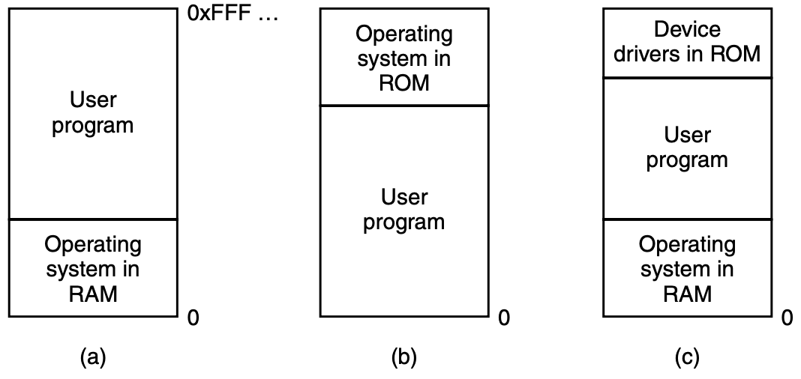
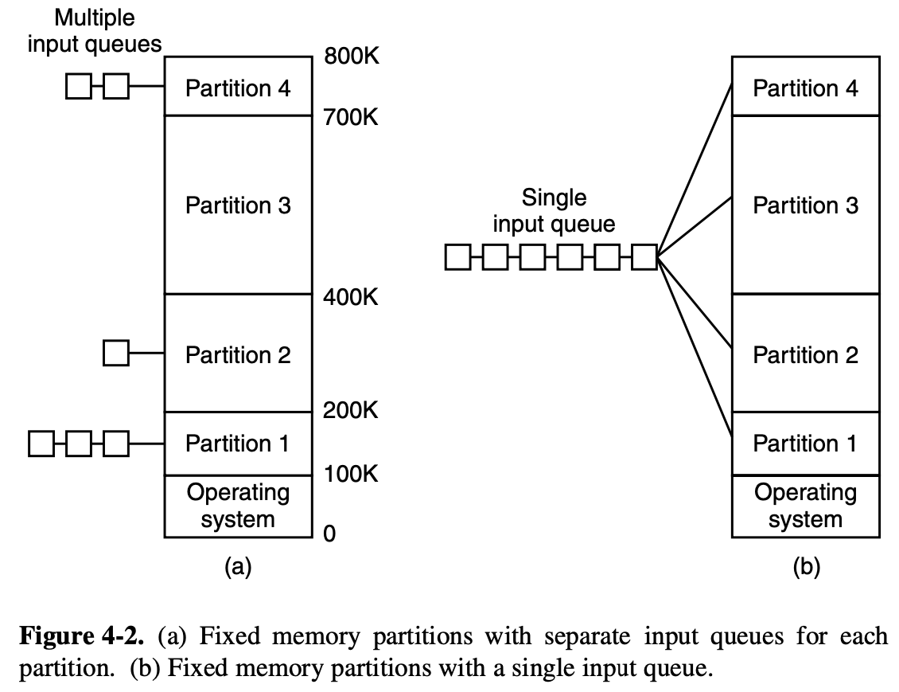
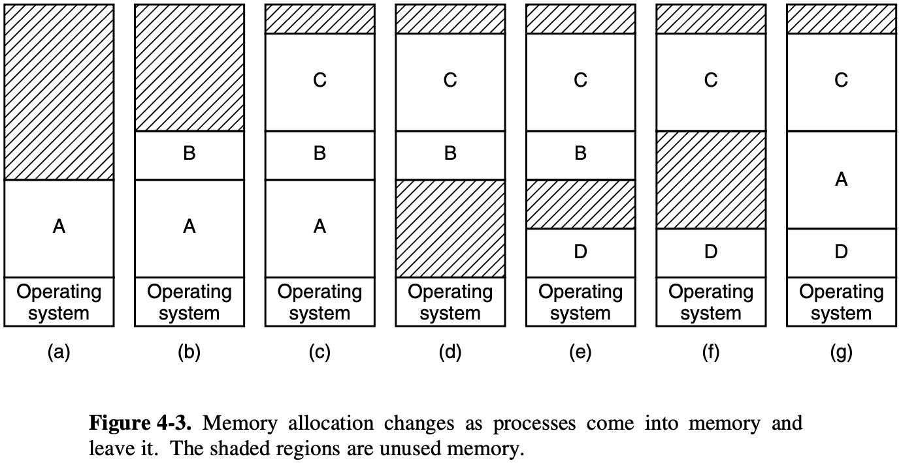
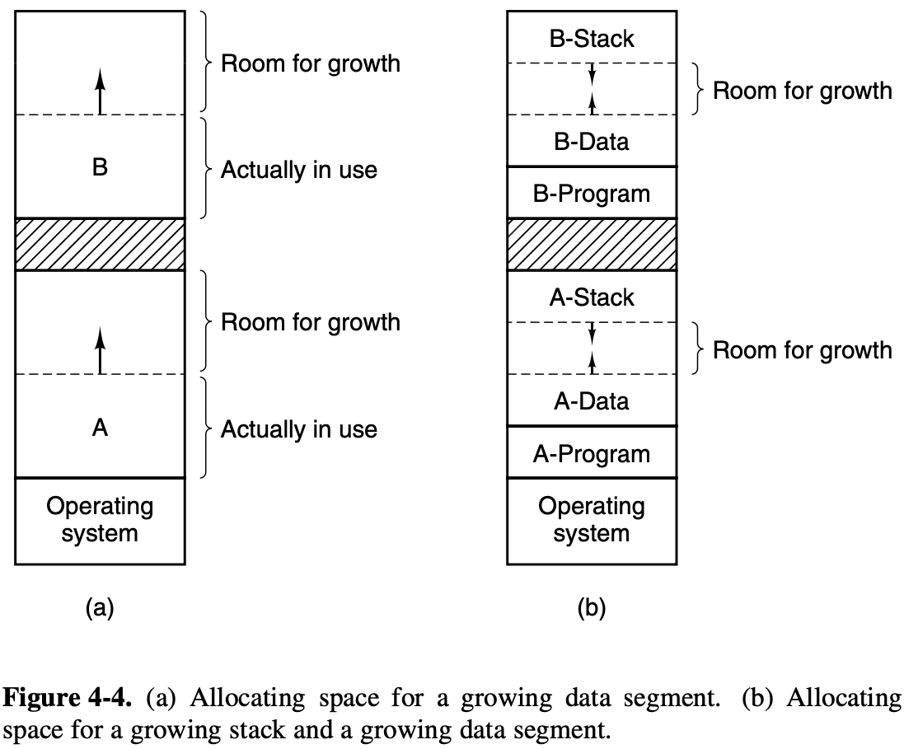
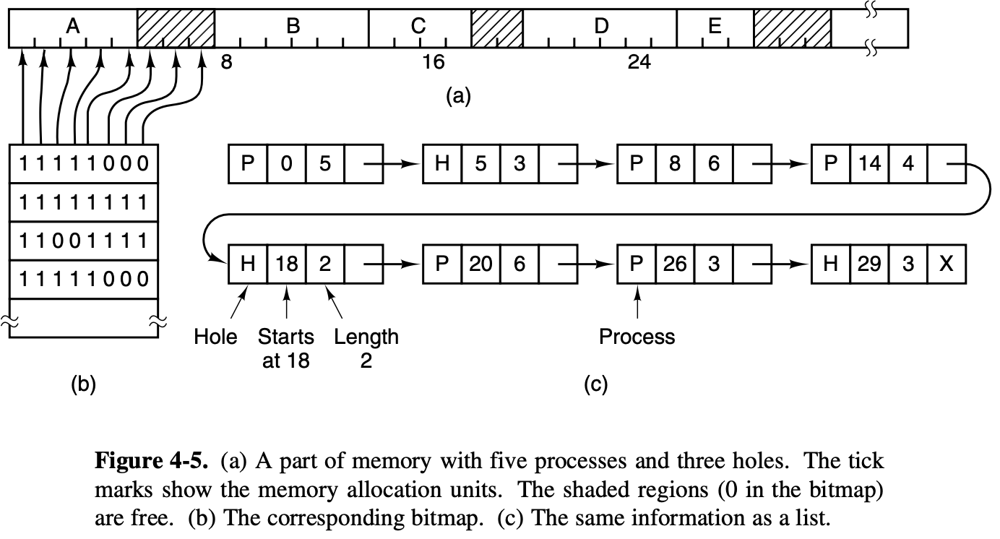

# Chapter 4: Memory Management
> wahoo! i'ma gonna win! i'ma wario!

Some definitions:
* Memory hierarchy: self explanatory
* Memory manager: manages the hierarchy, part of the OS
    * Keeps track of which part is in use, allocating memory to processes, deallocating, manage swapping between memory and disk when not enough RAM
    * Usually in the kernel

## Basic memory management
Two classes of memory management systems:
1. Those that move processes back and forth between main memory and disk during execution (swapping and paging)
2. Those that don't

Swapping and paging are artifacts caused by lack of RAM.

> Now Microsoft recommends having at least 128 MB for a single-user Windows XP system.
What a time to be alive

### Monoprogramming (no swapping/paging)
* One program at a time, share memory between program and OS
* 3 models (basic)
    1. Mainframes and minicomputers, obselete
    2. Palmtop computers and embedded systems
    3. Early PCs (MS-DOS) where portion of the system in ROM is called the BIOS (basic I/O system)
* Single threaded

### Multiprogramming with fixed partitions
* Multiple processes, at the same time
* Rarely used anymore? 
* Partition memory, queue processes in the smallest partition big enough to hold it
* Disadvantage is when large queues become empty but the small queues are extremely packed
* Counter for no. skips can be implemented to speed up queues

### Relocation and Protection
* Problems introduced by multiprogramming
* Protection problem: protecting the memory from unauthorized access
* Relocation problem: when a program is linked (combined into a single address space) the linker where each program begins in memory
    * Doesn't always solve protection problem if malware constructs new instruction and jumps to it
    * Absolute memory addresses used rather than relative, no way to stop a program from building an instruction that RWs to memory
* IBM's solution was to use a 4bit protection code for every 2KB of memory, so the hardware traps any processes running that has the wrong code
* Only the OS can change the codes

Another solution is to use a **base** and a **limit** hardware register
* The base register loads the address of the start of partition, limit loaded with length
* Each memory automatically has base register contents appended to it (CALL 100 -> CALL 100k + 100 if base = 100k)
* Slow, obselete

## Swapping
In batch systems, jobs are loaded into partitions and stay there until they're done. In timesharing systems, however, there might not be enough RAM to hold the processes, so the disk must be used to keep extra processes
* Swp memory and virtual memory
* See diagram
* Can compact all the processes and move them down as far as possible in a process called *memory compaction*; not often done because it requires a lot of CPU time

Memory is allowed to grow either via switching holes (like hermit crabs) or allocated extra memory when it starts; else they're blocked/killed.

### Memory management with bitmaps
When memory is assigned dynamically, the OS must manage it, either via **bitmaps** or **free lists** (basically a linked list).

Bitmaps:
* Memory divided up into allocation units in the byte-kilbyte range
* Corresponding to each unit in the bitmap is a 1 or 0 (T/F)
* The smaller the unit, the larger the bitmap 
* Good for fixed-size memory
* Issue is that if you want to add another process of size *k*, you need to find *k* consecutive units and that's slow

### Memory management with linked lists
What did I say?

Linked lists:
* Entries:
    * Hole/Process
    * Start address
    * Length
    * Pointer to next entry
* Algorithms used to allocate memory to newly created processes
    * First fit
    * Next fit

First fit:
* Scan list of segments until you get the first hole that fits the process
* Break hole into two - one for process, one for unused memory

Next fit:
* Same thing, but keeps track of where the next suitable hole is
* Slightly worse

Best fit:
* Searches the whole list for the hole that fits the best
* Slower
* First fit generates larger holes on average

There's also worst fit, to take the biggest hole possible, but that's not good

Quick fit: 
* Maintain separate lists for common sizes (standards)
* Expensive, but very fast

## Virtual memory
When programs are too big to fit into memory (like ImageNet dataset)

**Overlays**: splitting the program into pieces, and running them sequentially
* Operations done by the system
* Virtual memory: the combined size may exceed the actual available physical size, rest is kept on disk
* Works with multiprogramming devices

### Paging
* On any computer there exists a set of memory addresses that programs can produce
* When the program uses an instruction (e.g MOV REG, 1000), it does this to copy the contents of 1000 to REG
* **Virtual addresses** - these program-generated addresses, form **virtual address space**
* When virtual memory is used, they don't go to the memory bus; instead, they go to a Memory Management Unit that maps the virtual addresses onto physical memory addresses

Virtual Address Space:
* Divided up into units - **pages**; corresponding units in physical memory - **page frames**
* Always the same size, transfers between RAM and disk are always in page units
* MMU maps the instructions between virtual and physical memory space
* A **present/absent bit** keeps track of which pages are physically present in memory
* If the program tries to use an unmapped page, the MMU notices the fact and causes the CPU to trap the OS - **page fault**
    * The OS takes a little-used page frame, writes the contents to the disk, and puts the new page in its place
* Page table is used to keep track of everything

### Page tables
Virtual address is split into a virtual page numer (higher order bits) and an offset (lower order bits) 
* The offset deterines the size of the partition (like when you boot Arch)
* VPN is used to find page frame number

The page table must be a) very big and b) very fast
* Each process has its own page table
* Addresses are at least 32 bits, very big
* Must be done on every memory reference, bottleneck

