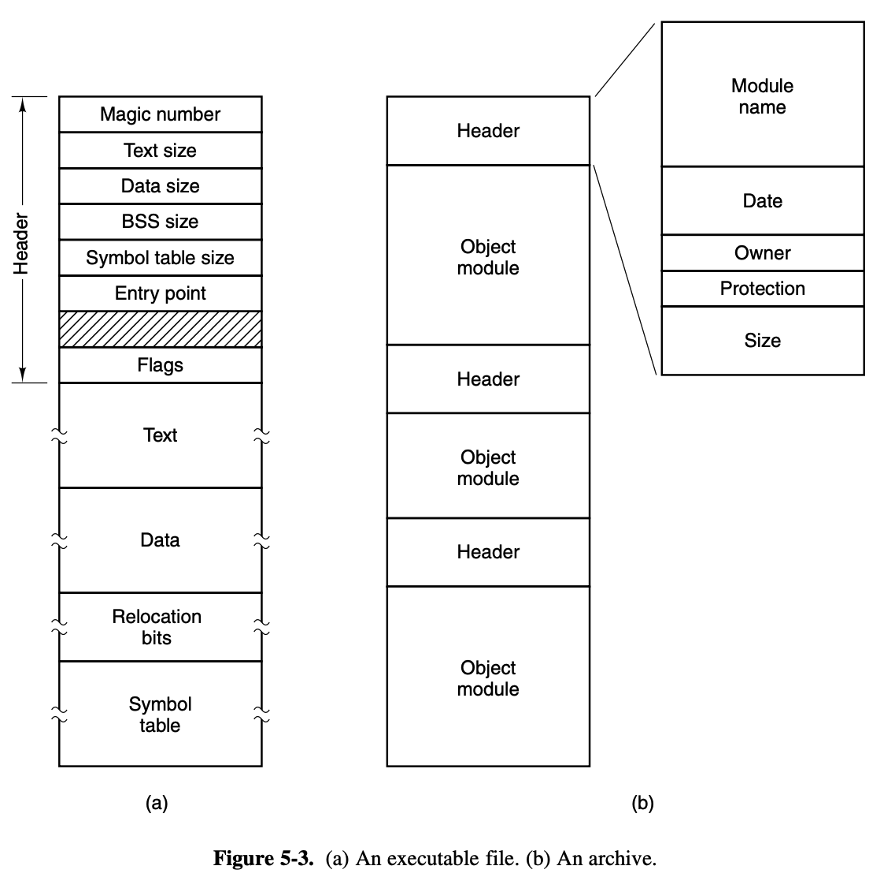
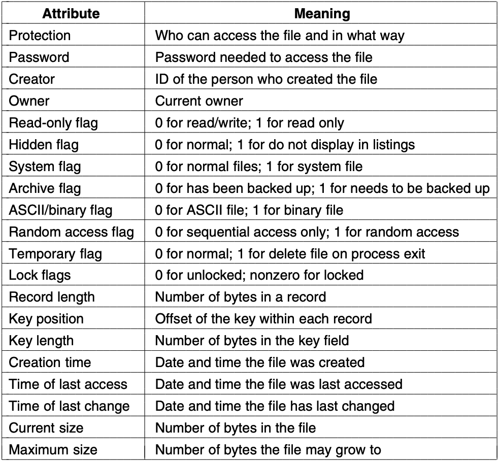
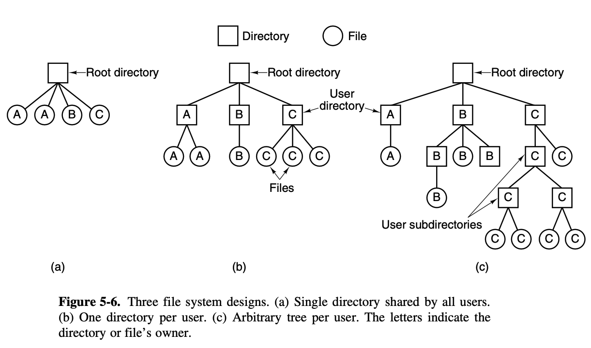
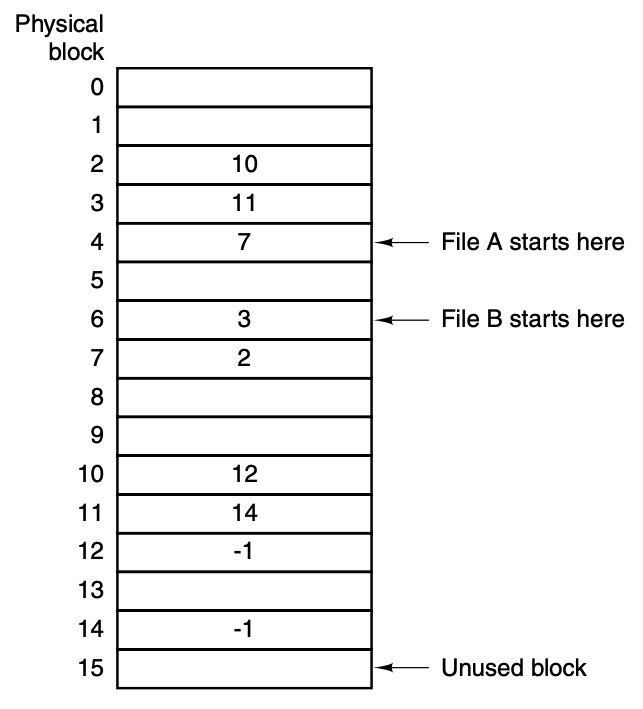
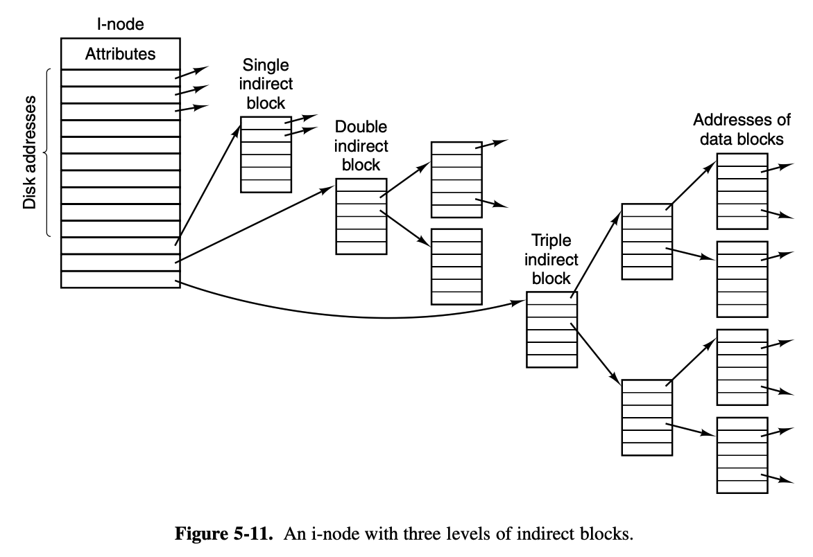
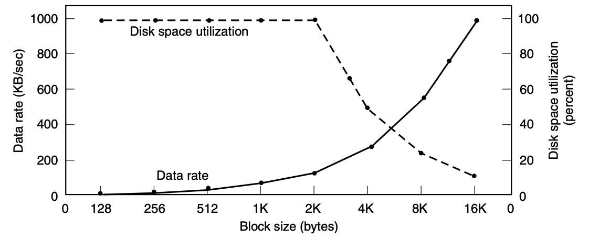
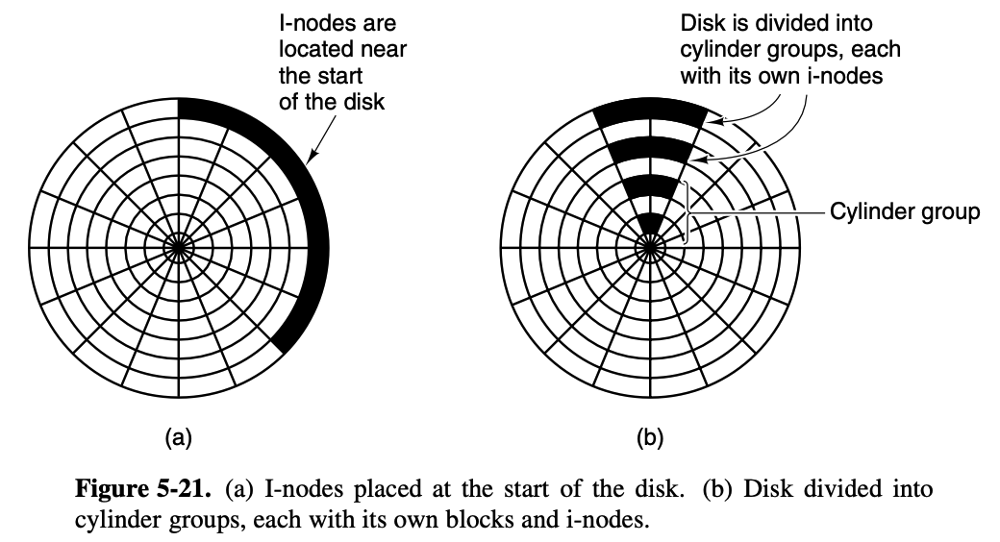

# Chapter 5: File Systems
> Remember that the content of this textbook precedes linux

Issues:
1. Storage is restricted to size of virtual address space
2. If you keep information in  a process' address space, it's lost when the process terminates
3. Multiple processes need to access the information at the same time, so information has to be process independent

3 requirements for long term information storage:
1. Possible to store very large amount of information
2. Information must survive process termination
3. Multiple processes must be able to access the information concurrently

Files are the solution to this. We have files for a reason.

## Files
> Subheadings I consider less important will be relegated to these bullet points 
* Naming
    * Two-part - name + extension (test + py); 
    * Some OS's distinguish between upper and lower case, some dont;
    * Double clicking means open
    * In UNIX, file extensions are just conventions (suggestions, not requirements)
> that's a lot of stuff taken for granted
* File structure
    * The operating system considers files as nothing more than byte sequences for maximum flexibility
    * 3 kinds of files: byte sequence, record sequence, tree
    * Record sequence files tend to have some sort of internal structure 
    * Tree structure files are a tree of records, each key corresponding to a fixed position on the record
* File types
    * UNIX has character and special block files, Windows has metadata
    * Regular files contain user information, directory files preserve structure (e.g../), character special files are related to IO and are used to model IO devices (printers, terminals, networks)
    * Regular files are usually binary/ASCII
    * ASCII can be edited and io-ed by any text editor
    * Binary files have internal structure despite looking like bolognese - starts with a **magic number** to identify it as an exe, or is a collection of compiled (but not linked) modules

### File access
* They used to be sequential, and can only be read in order from start to finish, but now there are **random access files**
* Random access files let you access it from any position, without having to go through everything previously first
* Now everything is random access

### Attributes (metadata)
* Protection: access control
* Password
* Creator* Random access files let you access it from any position, without having to go through everything previously first
* Now everything is random access

### Attributes (metadata)
* Protection: access control
* Password
* Creator* Random access files let you access it from any position, without having to go through everything previously first
* Now everything is random access

### Attributes (metadata)
* Protection: access control
* Password
* Creator* Random access files let you access it from any position, without having to go through everything previously first
* Now everything is random access

### Attributes (metadata)
* Protection: access control
* Password
* Creator* Random access files let you access it from any position, without having to go through everything previously first
* Now everything is random access

### Attributes (metadata)
* Protection: access control
* Password
* Creator* Random access files let you access it from any position, without having to go through everything previously first
* Now everything is random access

### Attributes (metadata)
* Protection: access control
* Password
* Creator* Random access files let you access it from any position, without having to go through everything previously first
* Now everything is random access

### Attributes (metadata)
* Protection: access control
* Password
* Creator* Random access files let you access it from any position, without having to go through everything previously first
* Now everything is random access

### Attributes (metadata)

### File operations
* Create
* Delete
* Open
* Close
* Read
* Write
* Append
* Seek (for random access)
* Get attributes
* Set attributes
* Rename
* Lock

## Directories
> Folders and such
Directories hold *attributes*, not the files themselves
* Each entry contains the file name, attributes, and addresses

Because the names are used as unique keys for the files, duplicate file names are not allowed. 

Two-layer hierarchy to separate 'root' directories is good for this - different users can give the same name to diifferent files, you just need to chroot it (i think)

 ### Directory operations
* Create: mkdir
* Delete: rm -rf
* Opendir
* Closedir
* Readdir
* Rename
* Link: letting a file appear in more than one directory
* Unlink

## Implementation
You need to consider: 
* Naming
* Operations
* Directory trees
* Layouts
* Efficiency

### Layout
If you look at the disk, the first section is the MBR (Master Boot Record) and contains the boot stuff and a partition table for each partition.
* Can also be called IPL (inital program loader), volume boot code, or masterboot
* No more than 4 **primary partitions**
* You can have extended partitions that point to a linked list of logical partitions
* Extended partitions -> subpartition table for more partitions and whatever you want to use it for 

### Implementing files
Contiguous allocation: 
* Contiguous run of disk blocks - a 50kb file will get 50 continuous 1kb blocks
* Makes reading very easy but is kinda hard to do as the disk becomes more fragmented and broken up - you need to find a hole with the correct size, which gets hard if you have a 4GB video of monkeys lying around somewhere

Linked list:
* A linked list
* Useful
* Can also use a table, where the pointers point to table locations and are terminated with -1

I-Nodes:
* Index nodes
* Used to keep track of which blocks belong to which file
* Given that one block, its possible to find all the attributes and addresses of the file's blocks
* Indirect blocks can be added to the last location for even more blocks, and you can make even double/triple indirect blocks

### Implementing directories
Essentially, it's there to map the name to the information needed to locate the data

Sharing files - A symbolic link/alias

### Space management
Block size:
* Most FS use fixed-size blocks that don't need to be adjacent
* Small = each file consists of many blocks; large = wasted space
    * Affects read speed
    * See graph

Keeping track of spare blocks:
* A list holds the pointers to the free blocks
* Bitmaps also work

Backups

this section of notes won't be useful to anyone other than myself because of what i did at work linking directly to this. The issues are all things i had to consider already:
1. do you back up everything?
2. Incremental dumps: periodically dumping all the files that have been changed since the backup - i should be very familiar with this. i am the file system itself 
3. Compression: the issue is obsolete - was a concern with the tape
4. Inconsistency: what if data is changed while you're backing up? take everything offline?
5. Security

Everything is a cache. You move from block/buffer cache to outside and cache in, cache out. cache money.

## Security
Confidentiality, integrity, and availability:
* Keep data private (exposure)
* Maintain access control (users)
* Make sure we can still access it (DOS)

