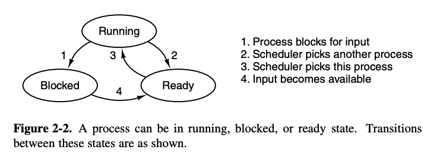
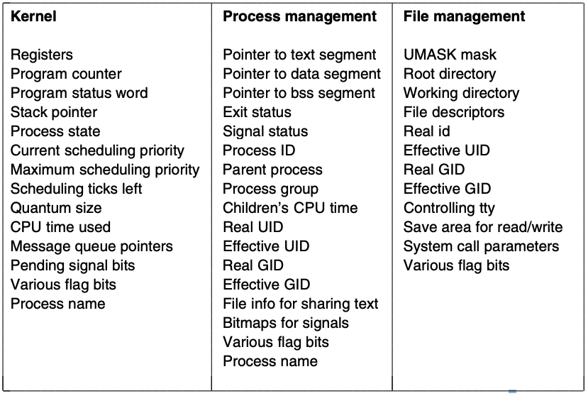
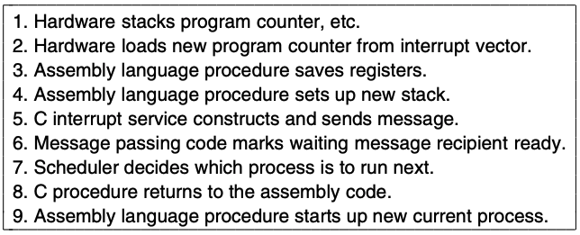

# Chapter 2: Processes
> Abstractions for running a program

## Process model
* Multiprogramming: switching processes very fast to give the illusion of parallelism
* Multiprocessing: having multiple cores running multiple threads at any one time
* Generally processes are sequential, only one program is running

### Process creation
1. System initialization
2. Execution of process creation system call by a running process
3. User request to create new process
4. Initiation of batch job

Foreground process = interacts with users; background process = have a specific function (e.g receiving requests for a website hosted locally) (daemons)
* Processes break down their task into smaller, more manageable processes
* **fork** clones processes, parent and child have the same memory image, environment strings and open files
    * Usually the child executes execve to cahnge the image and run a new program

### Process termination
1. Normal exit
2. Error exit
3. Fatal error
4. Killed by another process

Fatal error: big errors that make the program crash immediately (e.g compiling a file that doesn't exist)

### Process states
* Piping processes and programs
* Processes can be in 3 states: running, blocked, and ready 

* Transition 1 occurs when a process discovers it can't continue. Sometimes a system call needs to be executed to get into blocked state
* Transition 2 and 3 are caused by the process scheduler - part of the OS - without the process even knowing
    * 2 occurs when the scheduler decides "yep that's been long enough you go away"
    * 3 occurs on the other side of that
* Transition 4 occurs when an external event that a process is waiting for occurs (e.g keyboard input)
 
### Implementation of processes
* OS has a process table, with one entry/process
* Contains information on the process' state, program counter, stack pointer, memory allocation, status of open files, accounting and scheduling information, alarms and other signals; everything about the process must be saved when the process is switched from running to ready

Associated with each IO device class is an **interrupt descriptor table**, and the key part of each entry is the **interrupt vector** which contains the address of the interrupt service procedure. So if process 3 is running when the interrupt occurs, everything in the block is pushed onto the stack, and the computer jumps to the address specified by the IV.

### Threads

* A process is a way to group related resources together to be managed more easily (open files, child processes, signal handlers, etc)
* A thread of execution has a program counter that keeps track of the instructions to execute, and registers to hold the current working variables
* Multiple threads allow multiple executions to take the same place independently

|Per process items|Per thread items|
|-|-|
|Address space|Program counter|
|Global variables|Registers|
|Open files|Stack|
|Child processes|State|
|Pending alarms||
|Signals and signal handlers||
|Accounting information||

Switching threads is much faster when management is done in user space than when system calls are made. Thus, the kernel has a thread table to list all the threads in the system to schedule.
* In the user space, the thread chooses its successor before it blocks
* Otherwise, the OS chooses which one to run via a system call

Handling the errors and memory allocation while switching threads is done by the OS. 

When stack overflow occurs, the kernel provides more stack; in multiple threads, the kernel may not be aware of all these stacks and not grow them as needed.

 
