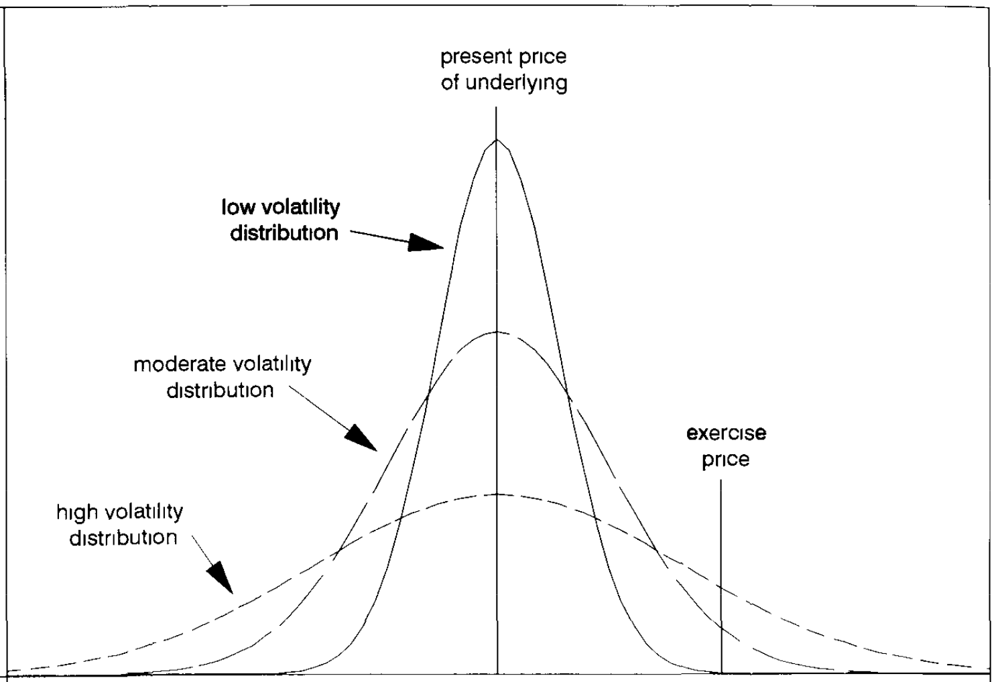
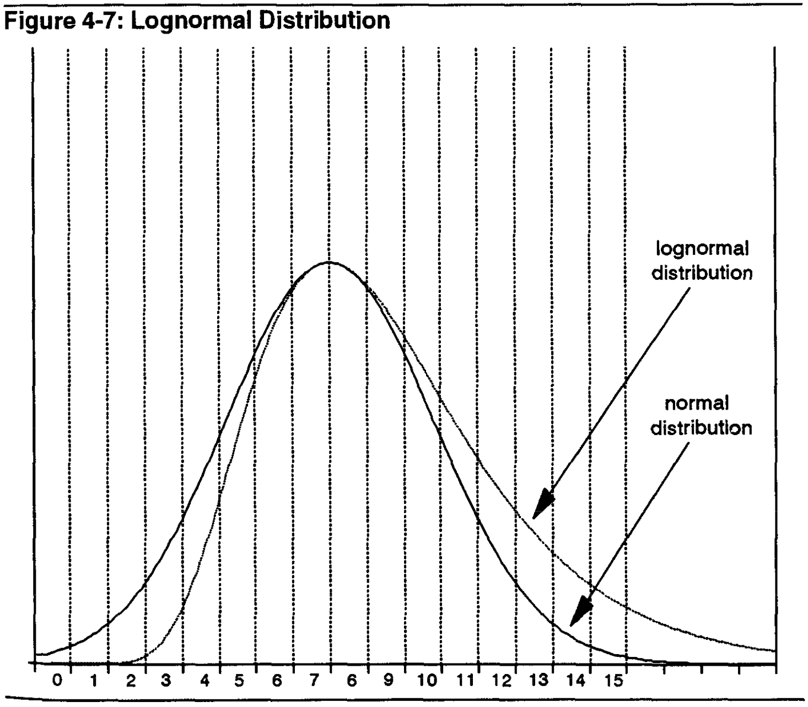
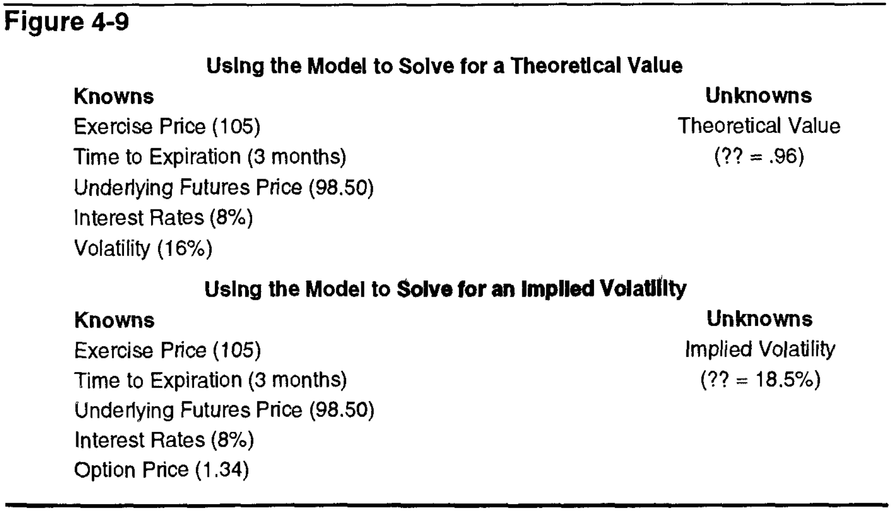

# Chapter 4: Volatility
> Models are used to assist traders, who decide whether the predictions make sense or not. 
> The BS model predicts the value of the contract based on the data. How much you should pay for an option, and you can execute based on how different it is from the market price
> **MARGIN OF SAFETY**

To recap, the option trader is concerned about the **speed** and the **direction** of the market. Volatility is a measure of speed.

## Random walks and normal distributions (i love normal distributions)
Random walk - trajectory of a random process (e.g ball drop bell curve)
* This is why the Wiener process is important
* The random left/right movement of the ball can be seen as the daily changes in an UC's market price, and the downward motion as time, so the price distribution at the end looks like the Gaussian

E.g a 100 contract, 15 days until expiration, evaluate a 105 call:
* The curve will look differently depending on the expected change per day (variance)
* Evaluate the probability of each option through this
* Volatility -> variance

> Only the outcomes that result in the option finishing in-the-money are important, everything else can be discarded

## Mean and standard deviation
Explaining the price changes via a Gaussian

Very rough calculations are enough; like so:
* Standard deviations:
    1. ±1: 68.3% of the time
    2. ±2: 95.4% of the time
    3. ±3: 99.7% of the time
* e.g if you have mean=7.5, sd=3, the probability that a value is between 5 and 10 is 68.3% (5 and 10 are within 1 sd)

### Parameters 
* Mean: underlying price 
* Standard deviation: volatility

### Lognormal distributions

f(x; \mu, \sigma) = \frac{1}{x\sigma\sqrt{2\pi}} \exp\left(-\frac{(\ln x - \mu)^2}{2\sigma^2}\right)

* Are distributions in the real world really normal?
* Skewed up, natural log of a variable that's normally distributed
* Black Scholes is a continuous time model, assumes volatility of the UC is constant, but continuously compounded
    * e.g a UC trading at 100, no interest -> same theoretical value for 90 and 110 puts (10% deviation)
    * Lognormal distribution will always weigh increases higher so 110 gets a higher value
    * Skewing up mitigates the issue of having potentially negative values for a UC (not possible, unless bankruptcy?)
* More realistic than a vanilla Gaussian

|Mean|E[X] = e^(μ + σ²/2)|
|Median|e^μ|
|Mode|e^(μ - σ²)|
|Variance|(e^σ² - 1) * e^(2μ + σ²)|

### Key assumptions governing price in Black Scholes Model
1. Changes in price of the UC are random, cannot be artificially manipulated, direction of movement can't be predicted
2. Percent change in underlying instrument is normally distributed
3. Because they're assumed to be continuously compounded, the distribution is lognormally distributed
4. The mean of the lognormal distribution = forward price of the underlying contract

## Daily and weekly standard deviations
* Yearly SD's are too long, longer than most options
* Approximate shorter periods (e.g day) by dividing annual volatility by sqrt(no. trading periods)
* e.g a day - 256 trading days a year, √256 = 16, so divide annual volatility by 16
    * 100 with volatility 20% -> 1.25 change per day

### Volatility and observed price changes
* Determine whether his expectations are being realized in the marketplace
* Validate whether the values he's using in the models are correct
* That's why models are continuously being adjusted. You never know if you're actually right.

## Types of volatility
### Future volatility
* Volatility that best describes the future price distribution
* The 'odds' of an UC
* Impossible to get (?)

### Historical volatility
* Volatility in the past
* Good to look at similar periods, not normalized over the whole history
* Also can look at range of timeframes, and decide the intervals to use (e.g days, weeks, months, etc)
* As a rule, base the calculation off the settlement-to-settlement price changes

### Forecast volatility
* Predictions by wizards

### Implied volatility
> Y'know, because of the implication
* Associated with the option rather than the UC
* If your theoretical value is different to the market value, and everyone is using the same model, why? input data
* Keep raising/lowering your volatility until the prediction = market value
* That value is the **implied volatility**

Future and implied volatilities are the most important. Future = value, implied = price.

Think about weather forecasts. You don't wear a full down jacket in July for a reason. You know historically that doesn't happen. The weather forecast will tell you the same. But if *everyone* is wearing a full down jacket for some miraculous reason, then you might consider at least bringing one along. The future volatility = forecast, implied = seeing everyone wear parkas.

### Seasonal volatility
* Cycles, like commodities

> Given its importance, it is not surprising that the serious option trader spends a considerable amount of time thinking about volatility. Using his knowledge of historical, forecast, implied, and, in the case of agricultural commodities, seasonal volatility, he must try to make an intelligent decision about future volatility. From this, he will look for option strategies which will be profitable when he is right, but which will not result in a disastrous loss when he is wrong. 

> Because of the difficulty in predicting volatility, a trader must always look for strategies which will leave the greatest margin for error.
