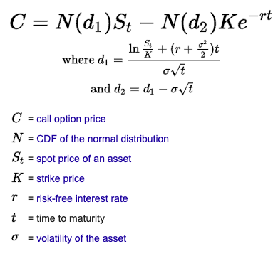
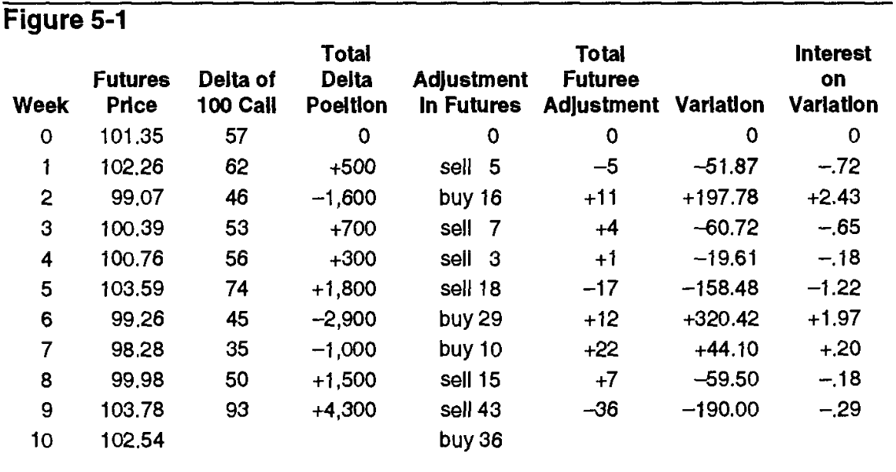

# Chapter 5: Using an Option's Theoretical Value
> Performance above all - how it works, what it's inputs are, whatever, doesn't matter; what matters is if it makes money or not
> More bets > size of bets again. Frequency frequency frequency
> Ideally as many adjustments as humanly possible - hence machines
> Options and stocks are good counterbalances because one is the opportunity to buy/sell

The Black-Scholes model solves the problem of predicting a value with relatively few inputs and simple math operations.

To see how a model performs, we first make two assumptions:
1. If the price distribution of the UC is accurately represented by the lognormal distribution
2. We actually know the future volatility of an UC

(these assumptions are completely improbable) but hypothetically if they were, we'd be able to profit off of any difference between the theoretical value and actual price.

## Example time
|June futures price|101.35|
|Interest rate|8.00%|
|Time to June expiration|10 weeks|
* Stock-type settlement (own immediately after execution), full payment of premium
* Assume we predict a future volatility of 18.3% over the next 10 weeks

### Immediate assumptions
* June 100 call will be highly traded as it's close to at-the-money
* Using the BS model, we get a theoretical value of 3.88, and it's being offered at 3.25
```
# norm is just a normal distribution boilerplate from scipy
def black_scholes(S, K, T, r, sigma, option_type='call'):
    """
    Calculate Black-Scholes option price for a European option.
    
    Parameters:
    S: Current stock price
    K: Strike price
    T: Time to expiration (in years)
    r: Risk-free interest rate (annual rate, expressed as a decimal)
    sigma: Volatility of the underlying stock (annual, expressed as a decimal)
    option_type: 'call' or 'put'
    
    Returns:
    option_price: Price of the option
    """
    d1 = (np.log(S / K) + (r + 0.5 * sigma ** 2) * T) / (sigma * np.sqrt(T))
    d2 = d1 - sigma * np.sqrt(T)
    
    if option_type == 'call':
        option_price = S * norm.cdf(d1) - K * np.exp(-r * T) * norm.cdf(d2)
    elif option_type == 'put':
        option_price = K * np.exp(-r * T) * norm.cdf(-d2) - S * norm.cdf(-d1)
    else:
        raise ValueError("Invalid option type. Use 'call' or 'put'.")
    
    return option_price

def calculate_greeks(S, K, T, r, sigma):
    """
    Calculate the Greeks for a European call option.
    
    Returns:
    delta, gamma, vega, theta, rho
    """
    d1 = (np.log(S / K) + (r + 0.5 * sigma ** 2) * T) / (sigma * np.sqrt(T))
    d2 = d1 - sigma * np.sqrt(T)
    
    delta = norm.cdf(d1)
    gamma = norm.pdf(d1) / (S * sigma * np.sqrt(T))
    vega = S * norm.pdf(d1) * np.sqrt(T)
    theta = -(S * norm.pdf(d1) * sigma) / (2 * np.sqrt(T)) - r * K * np.exp(-r * T) * norm.cdf(d2)
    rho = K * T * np.exp(-r * T) * norm.cdf(d2)
    
    return delta, gamma, vega, theta, rho
```



To profit off the difference, the first move is clearly to buy the option itself, since it's underpriced. 

Every purchase/sale of a theoretically mispriced option requires us to establish a counterbalance hedge by taking an opposing position in the UC, so small changes in the option will offset the change of the opposing position in the UC. 
* These hedges are *unbiased/neutral* as to the direction of the UC
* They aren't the same size, since that's just gonna cancel out the position entirely so you still have to be confident in the bet

The number that we use to establish a neutral hedge = ***delta***
1. The delta is always between 0 and 1.00
2. The delta of an option can change as market conditions cahnge
3. An UC always has a delta of 1.00

The delta is given by the partial derivative of the option price (in BS model) WRT the UC price.

In this case, the delta is 57 (0.57), so for each option purchased we must sell 57% of an underlying contract to establish a neutral hedge.
* 100 June 100 calls -> 57 June futures contracts

|Contract|Contract Delta|Delta Position|
|-|-|-|
|Buy 100 June 100 calls| 57|+5700|
|Sell 57 June futures|100|-5700|

+5700 - 5700 = delta neutral
* No preference to upward/downward movement in the underlying market
* Positive delta = up; negative delta = down

Technically, the odds are on our side but the outcome is still improbable, which may lead to a loss. 

### The trick to offset this possiblilty of short-term bad luck is to **make a lot of bets at the same favorable odds**. This way, we have better chances of making a profit.
* Volatility and interest rates are assumed to be constant

Returning to the example, suppose these are the numbers a week later:
* June futures price = 102.26
* Interest rate = 8.00%
* Time to June expiration = 9 weeks
* Volatility = 18.3%
* New delta = 62 (0.62)

New delta position is now +500
|Contract|Contract Delta|Delta Position|
|-|-|-|
|Buy 100 June 100 calls|62|+6200|
|Short 57 June futures|100|-5700|

### Whenever we begin a new bet we are required to return to a delta neutral position.
* Reducing position by 500 deltas - 5 futures contracts
* The 5 futures sold is an *adjustment* to the position
    * Not always adding to the theoretical edge
    * More to protect and ensure delta-neutralness

|Contract|Contract Delta|Delta Position|
|-|-|-|
|Buy 100 June 100 calls|62|+6200|
|Short 62 June futures|100|-6200|

So basically:
1. Purcahse/sell undervalued/overvalued options
2. Establish a delta neutral hedge against the underlying contract
3. Continuously adjust the hedge to make it stay delta neutral

## Closing the option
### 3 ways:
1. Letting the out-of-money options expire
2. Selling any in-the-money options at parity/intrinsic value or exercising them against the underlying futures contract
3. Liquidating any outstanding futures contract at market price

### Step-by-step of calculating the profits
(at expiration)

Liquidating June 100 calls:
* Sold at 2.54 or selling futures at 102.54 and exercising the calls
* Original price 3.25, loss = 0.71 per option = -71

Buying back the hedge:
* Futures sold at 101.35, bought back at 102.54, loss of 1.19 per contract = -67.83
* Total loss = -71-67.83 = -138.83

Adjustments:
* Result of trading adjustments = +205.27


Carrying costs:
* Buy calls, sell futures
* Stock-type settlement, full payment right away
* Interest loss of 325 * 0.08 for 10 weeks, -4.99

Variation costs:
* As futures move up and down cash is credited to/debited from a trader's account
* Financing debt caused by selling/buying shares will cost money
* In this case the total (from + and -) is +1.36

Putting it all together we have:
* Original hedge: -138.83
* Adjustments: +205.27
* Option carrying costs: -4.99
* Variation costs: +1.36

### Sum = +62.81
* So we did make money
* Volatility in this case was predicted via 10 price changes and calculated the annualized standard deviations of the log changes and volatility
* Frictionless assumption:
    * Freely buy or sell without restriction
    * All traders can borrow/lend money at the same rate
    * No transaction costs
    * No tax considerations

Market is **locked** if traders can't trade

## Parallel timelines
### Different volatility
* Higher: more price fluctuations, more and larger adjustments, more profit
* Lower: smaller price fluctuations, fewer and smaller adjustments, reduce profit
* Implied volatility: above = profit, below = loss

### Volatility changes
* Supposed it increases. Then the price of the call increases proportionally, and we can immediately sell for a tidy profit
    * If we do so, we also have to buy back the futures contracts at the same price (increased volatility has nothing to do with the UC)
    * We immediately realize the profit from the options sold, exactly as predicted by the BS model
* No point holding the position for 10 weeks   
* If implied volatility ever reaches the target, we can immediately sell calls and buy futures to realize expected profit

> The longer a position is held, the greater the possibility of error from inputs to the model

Going down:
* If it goes down, then we have a paper loss (new price - old price)
* Thug it out, hold and adjust
* Stay the course (unless that's clearly a bad idea)

### Another example
* Stock price = 48.5
* Interest rate = 8.00%
* Time to expiration = 10 weeks
* Expected dividend = 0.50 in 40 days
* Volatility = 32.4%

Pick the March 50 call:
* Theoretical value of 2.17
* Delta of 46
* Trading for 3


* only that this time we also account for the dividend, and the interest on dividends

Dynamic hedge

Option replication - cash flow from continuous hedging in the UC - is a mother sauce of strategies. We ball.
