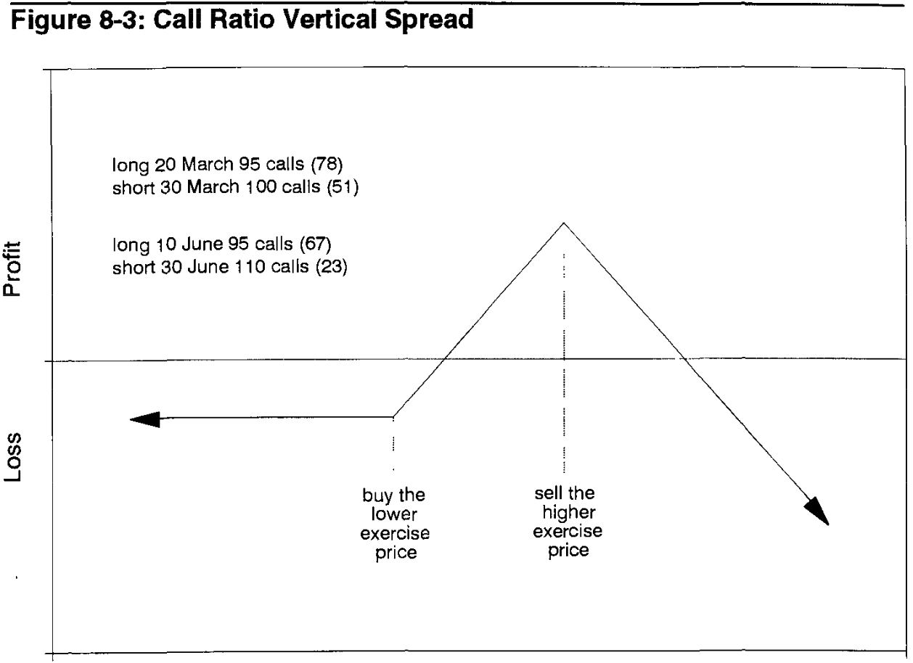
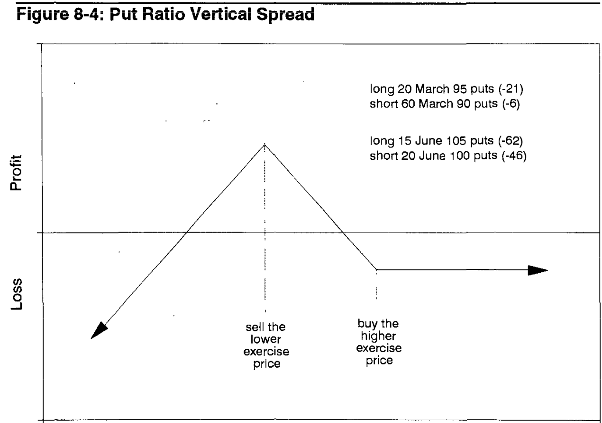
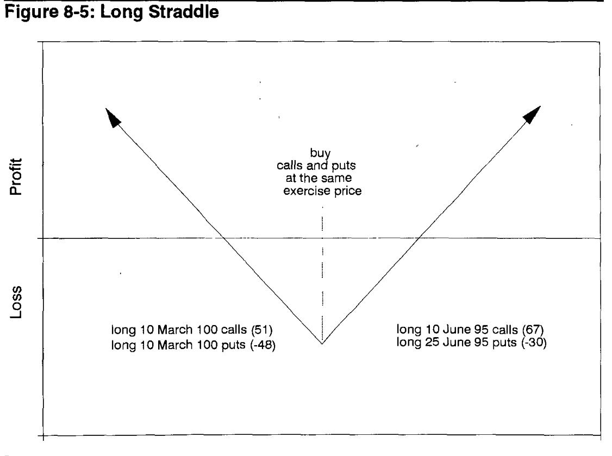
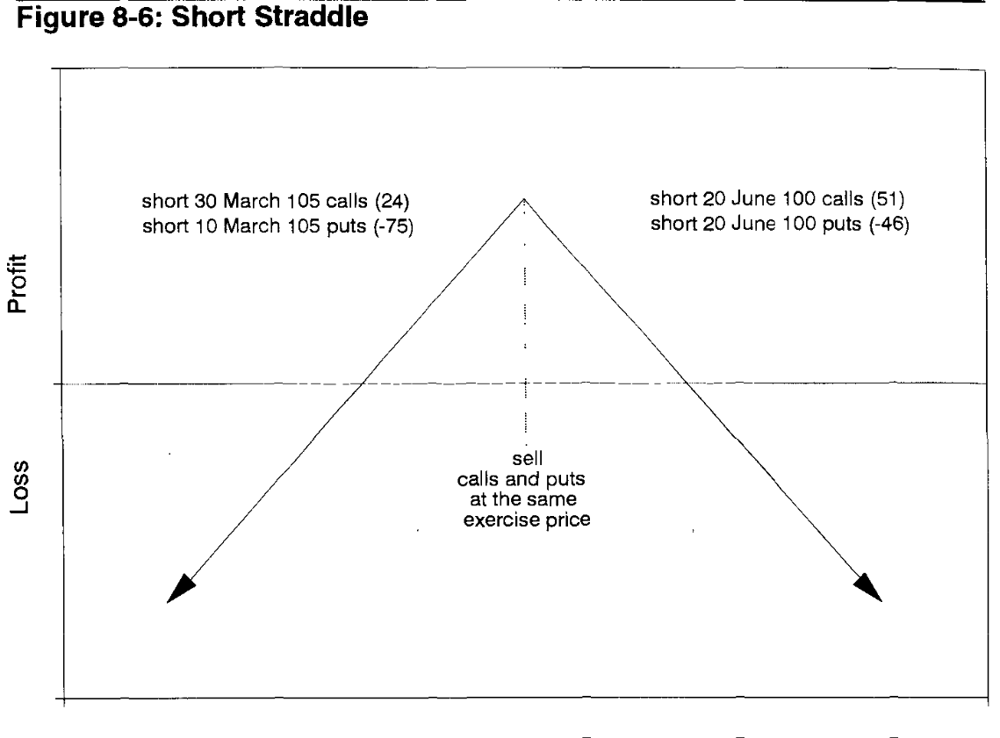
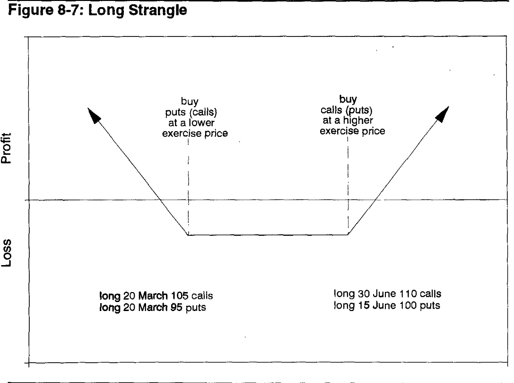
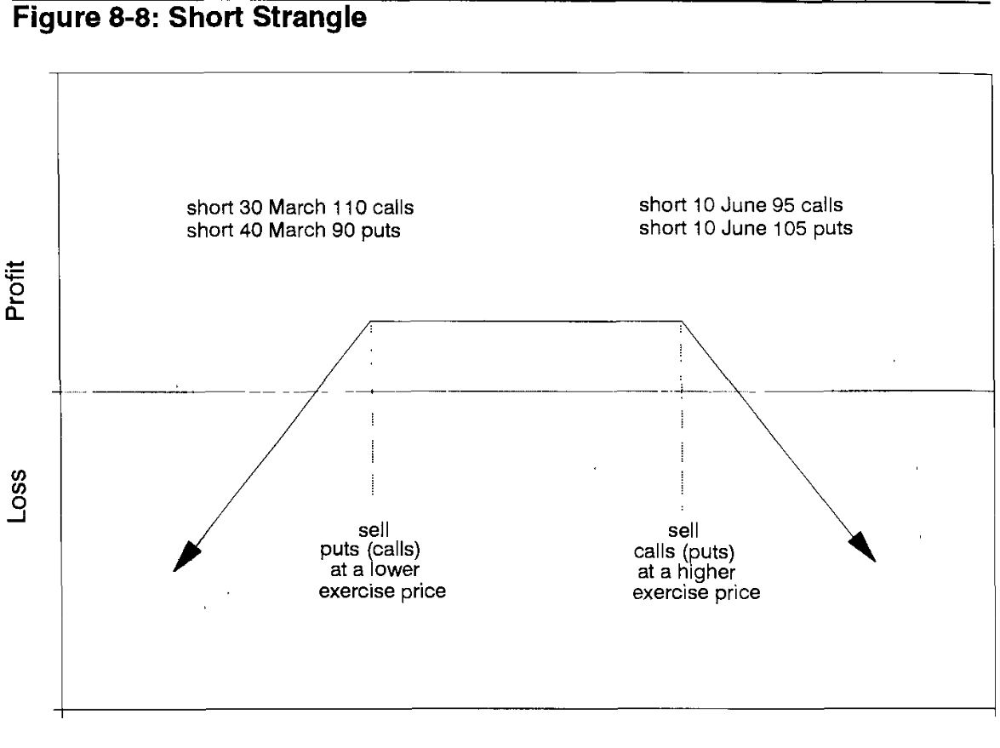
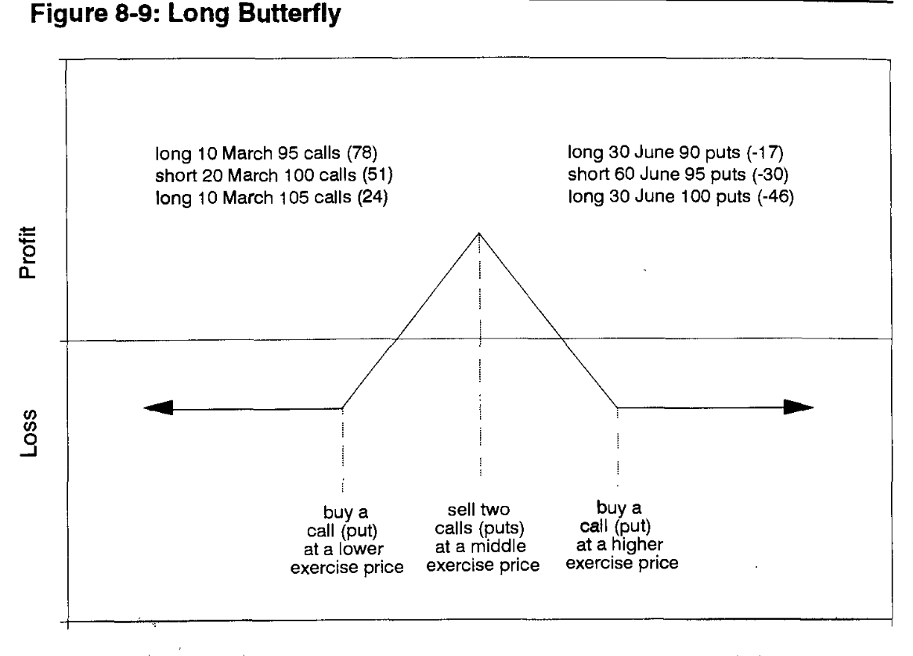
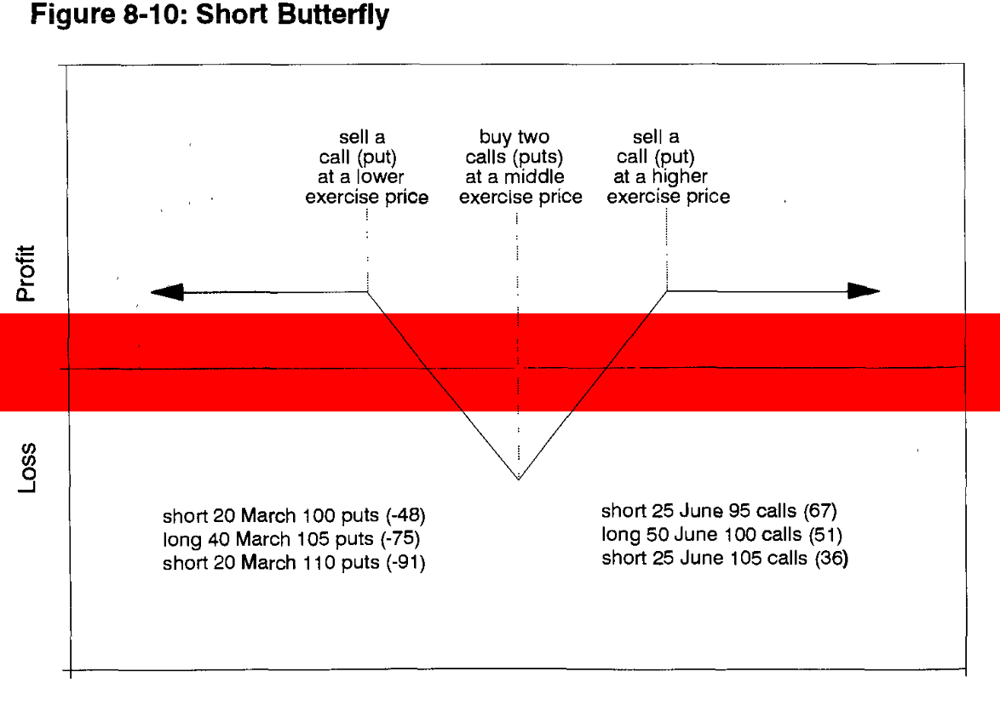

# Chapter 8: Volatility Spreads
> Hedge hedge hedge

## Some definitions:
### Backspread:
* A delta neutral spread which consists of more long options than short ones
* Expires at the same time
* Smaller deltas purchased, bigger deltas sold
* Call backspread -> long calls at higher exercise price, short calls at a lower price
* Put backspread -> long puts at lower exercise price, short puts at a higher exercise price

What this does is basically betting on movement - you either win from longing or by shorting.
* Typically done for credit (premium for sold > premium paid for purchased)
* If it explodes/collapses, you get the original credit 

So basically: 
* In a call backspread you lower your downside by shorting the smaller calls and longing the bigger calls so if they increase you can buy (infinite upside) and if the market collapses you get the credit from selling the calls
* In a put backspread, you short the bigger put and long the smaller put so if it increases then you make money from the longer puts (credit) and if it decreases you make a lot more because you sell the stock itself, and make more money from that

In both cases the worst case is a small movement, then you lose money.

### Ratio Vertical Spread
* Flip the backspread graph (opposite process)
* Expires at the same time
* More downside, you win if there's a small change but any large change results in loss (capped on one side) 

### Straddle
* Long call + long put or short call + short put
* Same price, different amount
* Expires at the same time
* It's usually executed with a 1:1 ratio but it can be *ratioed* 💀 so it consists of unequan numbers of calls and puts - ratio spread
* Long straddle has same characteristics as a backspread, the more movement the better
* Short straddle has the same characteristics as a ratio vertical spread, maximum profit if the market doesn't move much.

### Strangle
* Long call + long put or short call + short put
* Different prices, same amount (usually, if doing delta neutral then might not be)
* Expires at the same time
* Long strangle also needs nontrivial movement to be profitable
* Same thing with short strangle, barely any movement for max profit
* Identified by expiration month and prices (e.g June 95/105, either way for put/call works)
* Most leveraged position

### So in summary:
* Ratio vertical spreads, short straddles, short strangles all want *as little motion as possible*
* Backspreads, long straddles and long strangles all want *as much motion as possible* 

## More strategies
### Butterfly
> Going beyond two option contracts. Three, four, five, six, and upwards are all on the table.
* Equal number of long and short options
* Long butterfly is like a ratio vertical spread, short is like a backspread
* Described like 95/100/105 call (long 95, short 2 100, long 105). In this case, if the contract is <95 at expiry, everything is worthless (0); if the contract is above 105, it'll also be 0; if it's between the two, it'll be worth something. the closer to 100 the better.
* Buy outside sell inside = long butterfly
* Sell outside buy inside = short butterfly
* Advantage is limited risk and capped downside

### Time Spread
* Different expiry dates
* Most commonly is two 
