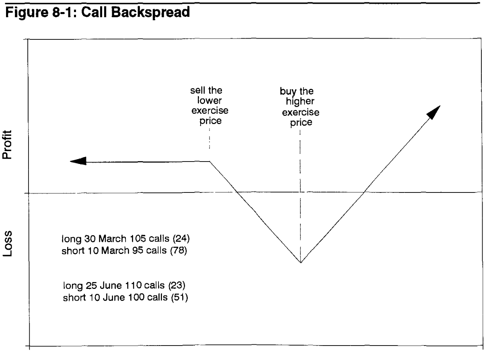
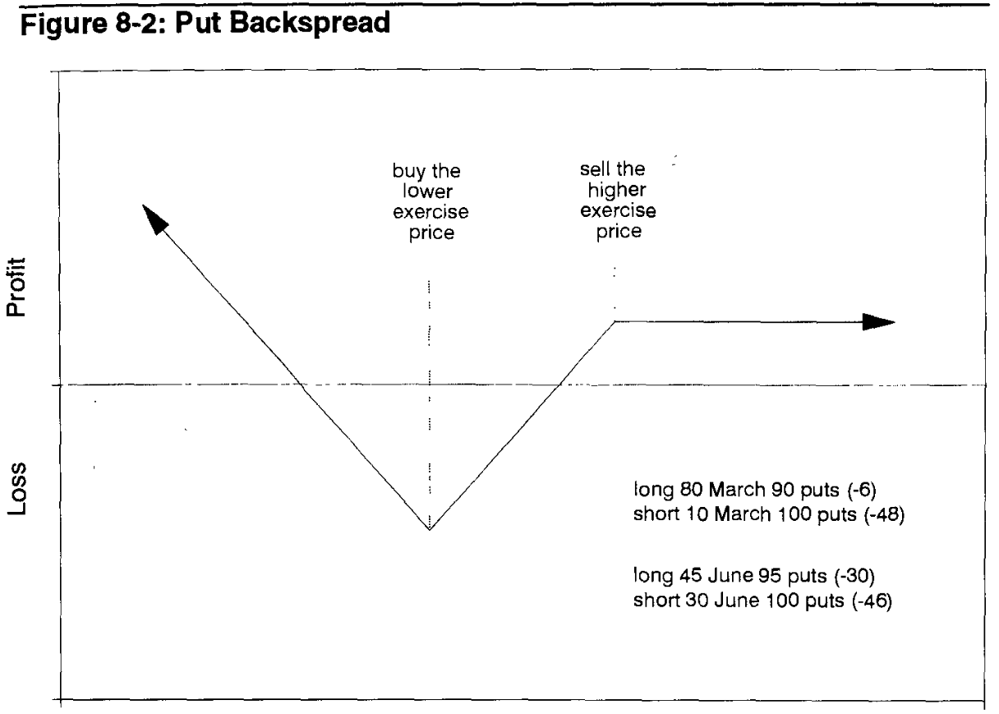

# Chapter 8: Volatility Spreads
> Hedge hedge hedge

## Some definitions:
### Backspread:
* A delta neutral spread which consists of more long options than short ones
* Expires at the same time
* Smaller deltas purchased, bigger deltas sold
* Call backspread -> long calls at higher exercise price, short calls at a lower price
* Put backspread -> long puts at lower exercise price, short puts at a higher exercise price

What this does is basically betting on movement - you either win from longing or by shorting.
* Typically done for credit (premium for sold > premium paid for purchased)
* If it explodes/collapses, you get the original credit 

### Ratio Vertical Spread

