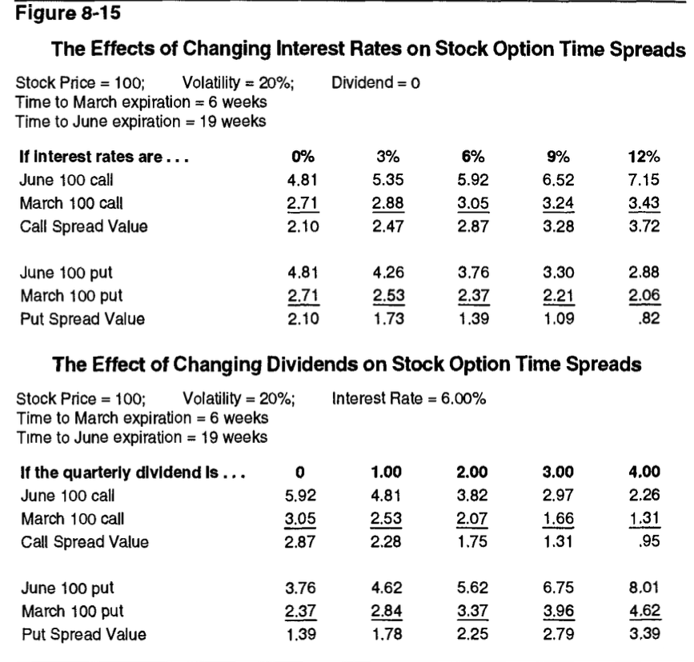

# Chapter 8: Volatility Spreads
> Hedge hedge hedge

## Some definitions:
### Backspread:
* A delta neutral spread which consists of more long options than short ones
* Expires at the same time
* Smaller deltas purchased, bigger deltas sold
* Call backspread -> long calls at higher exercise price, short calls at a lower price
* Put backspread -> long puts at lower exercise price, short puts at a higher exercise price

What this does is basically betting on movement - you either win from longing or by shorting.
* Typically done for credit (premium for sold > premium paid for purchased)
* If it explodes/collapses, you get the original credit 

So basically: 
* In a call backspread you lower your downside by shorting the smaller calls and longing the bigger calls so if they increase you can buy (infinite upside) and if the market collapses you get the credit from selling the calls
* In a put backspread, you short the bigger put and long the smaller put so if it increases then you make money from the longer puts (credit) and if it decreases you make a lot more because you sell the stock itself, and make more money from that

In both cases the worst case is a small movement, then you lose money.

### Ratio Vertical Spread
* Flip the backspread graph (opposite process)
* Expires at the same time
* More downside, you win if there's a small change but any large change results in loss (capped on one side) 

### Straddle
* Long call + long put or short call + short put
* Same price, different amount
* Expires at the same time
* It's usually executed with a 1:1 ratio but it can be *ratioed* 💀 so it consists of unequan numbers of calls and puts - ratio spread
* Long straddle has same characteristics as a backspread, the more movement the better
* Short straddle has the same characteristics as a ratio vertical spread, maximum profit if the market doesn't move much.

### Strangle
* Long call + long put or short call + short put
* Different prices, same amount (usually, if doing delta neutral then might not be)
* Expires at the same time
* Long strangle also needs nontrivial movement to be profitable
* Same thing with short strangle, barely any movement for max profit
* Identified by expiration month and prices (e.g June 95/105, either way for put/call works)
* Most leveraged position

### Butterfly
> Going beyond two option contracts. Three, four, five, six, and upwards are all on the table.
* Equal number of long and short options
* Long butterfly is like a ratio vertical spread, short is like a backspread
* Described like 95/100/105 call (long 95, short 2 100, long 105). In this case, if the contract is <95 at expiry, everything is worthless (0); if the contract is above 105, it'll also be 0; if it's between the two, it'll be worth something. the closer to 100 the better.
* Buy outside sell inside = long butterfly; better if less movement
* Sell outside buy inside = short butterfly; better if more movement
* Advantage is limited risk and capped downside

### Time Spread
* Different expiry dates
* Most commonly is to have opposing positions in options of the same type of the same excercise price
* The strategy itself means to either long/short the time spread
    * Buy long term sell short term - long the time spread (believe that it won't move much in the short term)
    * Sell long term buy short term - short the time spread (believe that it will move a lot in the short term)
* The point of the second option is to balance out the overall risk
* Basically with the long, if it doesn't fluctuate much in the short term then you make money off the premium

## The Effect of Changing Interest Rates and Dividends
Consider a trader initiates a long time spread under these conditions: 
* Stock price: 100
* Interest rate: 12%
* Dividend: 0

Long 10 June 100 calls, short 10 March 100 calls
* Rho: the sensitivity of an option's price to changes in the risk-free interest rate
* If the interest rate increases, long calls will increase more, so they will have a positive rho
* Opposite effect on puts - the interest rate increasing decreases the value of the put (other people will win)
* Increase in dividends lowers the forward price of a stock

> A short squeeze occurs when a heavily shorted stock's price increases, forcing short sellers to buy back shares to cover their positions, which in turn drives the price even higher.

### Diagonal Spreads
* Like a time spread, but options have different prices
* Not very generalizable given the no. permutations and variations
* The one type that you can generalize is if the options are of the same type and have approximately the same delta -> like time spread

### Other Variations
> Here for the sake of brevity sell is represented by 0 and buy is represented by 1

|Type|Description|Exercise Price|Expiry|Amount|Ideally|
|----|-----------|--------------|------|------|-------|
|Christmas Tree/Ladder|Type of spread, usually 3 exercise prices, 100 or 011|Different|Same|Uniform|Long less movement, short more movement|
|Iron Butterfly|10/01 Strangle/Straddle, the straddle price bisects the strangle's prices|Different|Same|Uniform|Long iron = short butterfly (more movement) and vice versa|
|Condor|Like a butterfly, but split the inside prices (1001/0110)|Different|Same|Uniform|Same as butterfly|

### Spread Sensitivities
Recap on the terms
| Greek | Description |
|-------|-------------|
| Delta (Δ) | Rate of change in option price relative to underlying asset price. Ranges -1 to 1. |
| Gamma (Γ) | Rate of change in delta relative to underlying asset price. Measures delta's stability. |
| Theta (Θ) | Rate of option price decay over time. Usually negative for long options. |
| Vega (ν) | Sensitivity of option price to changes in implied volatility of the underlying asset. |
| Rho (ρ) | Sensitivity of option price to changes in the risk-free interest rate. |

* Basically spread-specific parameters (like unique delta, gamma, theta, vega, rho but other details)
* Ratio vertical spreads, short straddles, short strangles, long butterflies, long time spreads all want *as little motion as possible*
* Backspreads, long straddles, long strangles, short butterflies, short time spreads all want *as much motion as possible* 
> Hurt by movmement = negative gamma; benefit from movement = positive gamma (10/01 relationship with theta)
* So the longer a negative gamma spread is in the market the more hurt it is 
* Spreads that benefit from high volatility will have high vega

| Category | Gamma | Vega |
|----------|-------|------|
| Backspread | Positive | Positive |
| Ratio Vertical Spread | Negative | Negative |
| Long Time Spread | Negative | Positive |
| Short Time Spread | Positive | Negative |

more tables
| Spread Type | Delta Position | Gamma Position | Theta Position | Vega Position |
|-------------|----------------|----------------|----------------|---------------|
| Backspread | 0 | + | - | + |
| Long Straddle | 0 | + | - | + |
| Long Strangle | 0 | + | - | + |
| Short Butterfly | 0 | + | - | + |
| Ratio Vertical Spread | 0 | - | + | - |
| Short Straddle | 0 | - | + | - |
| Short Strangle | 0 | - | + | - |
| Long Butterfly | 0 | - | + | - |
| Long Time Spread | 0 | - | + | + |
| Short Time Spread | 0 | + | - | - |

### Choosing an Appropriate Strategy
* Calculate the values (the ones in the tables above)
* If options are underpriced, look for spreads with a positive vega (and vice versa)
* Basically tells you to do the work

### Adjustments
Different strategies to it
1. Adjust at regular intervals - like cost averaging
2. Adjust when it reaches specific values (e.g delta)
3. Adjust by vibes (depends on you)

There are also contingency orders (like if/else statements):
* All or None
* Fill or Kill
* Immediate or Cancel
* Market If Touched
* Market On Close
* Not Held
* One Cancels the Other
* Stop Limit Order
* Stop Loss Order
