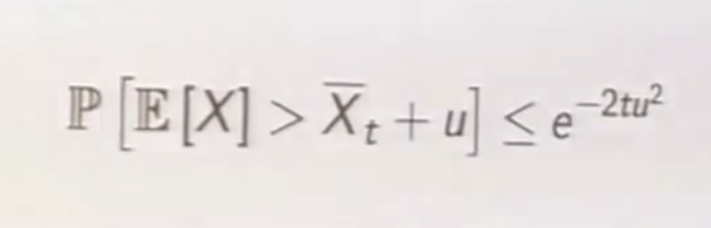

# Chapter 10: On-policy Control with Approximation
> Extending function approximation from states to actions

## Episodic semi-gradient control
Before it's learning states -> value function (U_t), now it's S_t, A_t -> U_t.
* Update target U_t 
* Update is still weighted loss x gradient (as usual)
* Episodic semi-gradient one-step SARSA

## Semi-gradient n-step SARSA

Look n steps ahead and update weights via gradient-based methods
* Again, there's an optimum somewhere between 1 and MC (same for tiling)

## Average reward: a new problem setting for continuous tasks
The quality of a policy π is defined as the average reward:

Ergodic: A system or process is considered ergodic if it has the same statistical properties when averaged over time as it does when averaged over the entire state space. In other words, the time average equals the space average.

# David Silver Lecture 8: Integrating Learning and Planning
Local definition of model: the agent's understanding of the environment and how states translate to other states and rewards

Recap:
* Model free RL: value function learns from environment, no model
* Model based RL: plan value function from model

> Model based doesn't mean machine-learning model, but model of the environment. Like an MDP. 

MDP isn't a specific thing, it's just a process where you take S, A and get R, S'
* So NNs that predict MDPs only need to take SA as an input (or even just S, then use it to predict A and R) (i thought it before he said it lets go)
* E.g taking fundamental data -> buy/sell signal
* Given S, A, what's the probability that you'll arrive in state S'
* Supervised learning problem (labeled input output)

|Parameters|Problem|
|-|-|
|Predicting reward from SA|Regression|
|Predicting probability of having state S' from SA|Density estimation|

Table lookup model is an example of non-parametric method - you just look up what the expected state would be for a given transition; learning via statistics and not gradients.
* You take observations and model the environment using it:
* It's literally just counting

## Dyna
* Use 'everything'
* Look at diagrams from last chapter notes:  value/policy -> experience -> model (of the environment) -> improving value
* Real data is more valuable
* Dyna 2 uses simulated experience and real experience

This was shown in the previous notes (?) but there's value in repeating it. Spaced repetition learning.

## Simulation-Based Search
> How to plan effectively (MCTS?)
You look ahead, and use the model of the MDP to look forward
* Focus on what's likely to happen next - there's a lot of things you don't really care about. Like bongcloud attack
* Simulate episodes from current state with model
* Apply model-free RL to simulated episodes (raw maximizing reward/follow policy)
* MC control -> MC search; SARSA -> TD search

Given a model M and a simulation policy π:
1. For each action, simulate K episodes from the current state
2. Evaluate actions via mean return
3. Select current action with maximum value

### MCTS (he finally said it)
1. Given a model M, simulate k episodes from current state s using simulation policy π
2. Build a search tree containing explored states and actions
3. Evaluate states by mean return of episodes from s, a
4. After search, select current (real) action with maximum value in search treeo

Works wonders for non-bruteforceable games (e.g AlphaGo) (explore the parts that work)

# SIMULATION-BASED SEARCH WORKS

# Lecture 9: Exploration and Exploitation
> Goes back to the first chapters of the textbook
|Exploration|Gather more information|
|Exploitation|Make the best decision given current information|
* Best strategy may involve giving up short-term rewards
* More information (usually) = better decisions

### Multi-armed bandit
* Action value is mean reward for action a
* Optimal value is the action that brings max reward
* Regret is opportunity loss
* Total regret = total opportunity loss
    * Count is the expected number of selections for action a
    * Gap is the difference in value between action a and the optimal action a*
* Minimize total regret
    * Regret is a function of gaps and counts
    * KL divergence
    * Described by the gam and KL divergence

Arms are represented as distributions
* Try the arm with the highest possible values, not the highest probability of having a high value (usually high variance)
* Higher potential mean > higher mean

### Upper Confidence Bound
> opposite of ELBO
* Estimate an upper confidence U for each action value
* Such that q(a) ≤ Q_t(a) + U_t(a) with a high probability (predicted value ≤ Q Value + Confidence?)
* Depends on no. times selected, the higher the times the higher the confidence
* Select action maximizing confidence bound

Hoeffding's inequality: 

* If you have some random variables and take an empirical mean of the data, the probability that the sample mean is wrong by more than *u* is upper bounded by e^-2tu^2
* In MAB cases with bounded rewards (ususally scaled between 0 and 1) the probability you're wrong can be computed the same way

### UCB1 algorithm

* A policy like epsilon-greedy, which chooses action based on maximum return and upper confidence bound
* The argmax wraps the Q and the sqrt

Achieves log asymptotic total regret 

Probability matching: selecting action according to probability that it's the optimal action
* Pick actions in proportion to the probability that they could be the max
* Thompson sampling: 
    * Sample from the posterior (computed via Bayes law)
    * Estimate upper confidence from posterior
    * Choose action that maximizes Q_t(a) + UC
    * Basically sample then choose the action that gives the best result

## Quantify information
* Exploration -> gains information
* Quantifying the value of information - how much are you willing to pay for that bit of information
* Information is worth more in uncertain situations

At each step there's an information state S~ summarizing all accumulated information
* Each action A causes a transition to a new information state wtih probability P~^A_S~, S'~
* ANOTHER MDP M = <S, A , P, R, gamma>

Infinite MDPS can be solved via RL (model free)

Gittins indices is the DP method of solving transition probabilities?

Bayes-adaptive RL:
* Characterizing information with posterior distribution
* Update of prior with Beta/whatever distribution is the transition function P

MDPs can be augmented to include information state
* Augmented state stores state and accumulated information
* Approximate everything

Methods to explore/exploit:
1. Random
2. Optimism
3. Information state space
