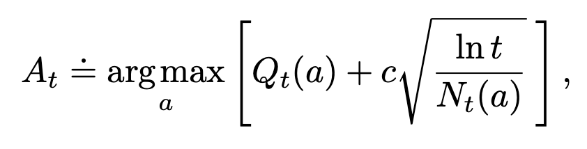
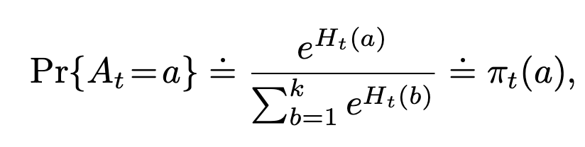

## Basic overview
* First chapter bandit (single-solution) problems, rest MDPs (and Bellman equation, value functions, DP, monte carlo methods, temporal-difference learning)
* SA spaces are small enough to be described by tables

# Chapter 2: Multi-Armed Bandit
> An intro to exploration vs exploitation

Strategies coverd:
1. Greedy: highest value reward
2. Epsilon-greedy: highest value reward, but every move there's an *epsilon* chance that it'll choose a random move
3. Upper Confidence Bound (UCB): using how often the action's been picked before as a confidence
4. Gradient bandit algorithms: learning a *preference* for each action, determined via softmax
5. Associative search (contextual bandits): using contextual information to increase accuracy

UCB:

Gradient bandit:

