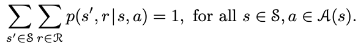
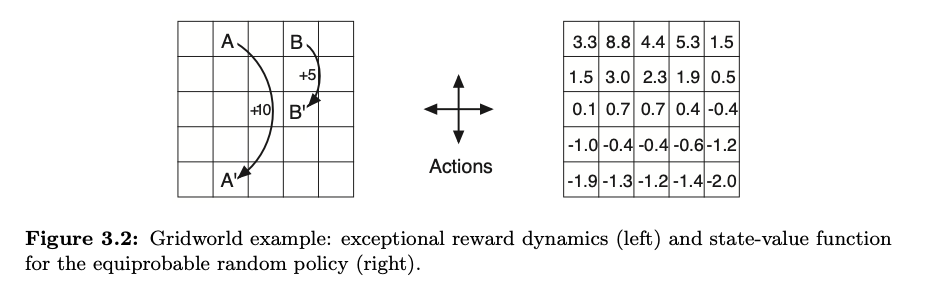

# Chapter 3: Finite Markov Decision Processes
> 

## Some basic notes
MDPs:
* learner + decision maker = agent
* everything else = environment 
    * anything that can't be changed arbitrarily by the agent = environment
    * boundary represents limit of agent's absolute control, not of its knowledge
* SARSA: State Action Reward State Action
* function *p* defines the dynamics of an MDP - the probability of values occuring at time *t* given the previous state-action pair *s* and *a*
* MDPs are only dependent on the previous SA pair, nothing before that. one step behind only.

p specifies a probability distribution for each choice of *s* and *a*, that is, 

### from the four-argument dynamics function *p*, one can compute anything else one might want to know about the environment
you can find the state transition probabilities:

$$p(s'|s,a) \doteq \text{Pr}\{S_t = s' | S_{t-1} = s, A_{t-1} = a\} = \sum_{r \in \mathcal{R}} p(s',r|s,a).$$

expected rewards for SA pairs via r: S x A -> R:

$$r(s,a) \doteq \mathbb{E}[R_t | S_{t-1}=s, A_{t-1}=a] = \sum_{r\in\mathcal{R}} r \sum_{s'\in\mathcal{S}} p(s',r|s,a),$$

expected rewards for SAS triples as r: S x A x R:

$$r(s,a,s') \doteq \mathbb{E}[R_t | S_{t-1}=s, A_{t-1}=a, S_t = s'] = \sum_{r\in\mathcal{R}} r \frac{p(s',r|s,a)}{p(s'|s,a)}.$$

Usually the four-argument *p* function is used but these have their value too.

### 3.2 Goals and Rewards
> That all of what we mean by goals and purposes can be well thought of as the maximization of the expected value of the cumulative sum of a received scalar signal (called reward).

### 3.4 Unified Notation for Episodic and Continuing Tasks
> this might be helpful to people actually using this for notes purpose
$S_{t}$: state representation at time t

$S_{t, i}$: state representation at time t of episode i

Same for the following:
* A: action
* R: reward
* π: policy
* T: time

## 3.5 Policies and Value Functions
> RL methods specify how the agent's policy changed as a result of its experiences.
Formally, a policy is a mapping from states to probabilities of selecting each possible action.

Similarly, a value function is a function estimating how good it is for the agent to be in a given state.
* in my words, predict the return of taking an arbitrary action x

In MDPs, we can define the value function formally by:

$$v_\pi(s) \doteq \mathbb{E}_\pi[G_t | S_t=s] = \mathbb{E}_\pi\left[\sum_{k=0}^{\infty} \gamma^k R_{t+k+1} \middle| S_t=s\right], \text{ for all } s \in \mathcal{S}$$

Similarly, we can define the q value (action/value function), the expected return of taking action a starting from state s, as:

$$q_\pi(s,a) \doteq \mathbb{E}_\pi[G_t | S_t=s, A_t=a] = \mathbb{E}_\pi\left[\sum_{k=0}^{\infty} \gamma^k R_{t+k+1} \middle| S_t=s, A_t=a\right].$$

* They can be estimated from experience
* Actions generally converge to the action values
* **Monte carlo methods** - averaging over many random samples of actual returns

Value functions satisfy recursive relationships: 

$$$\begin{align*}
v_\pi(s) &\doteq \mathbb{E}_\pi[G_t | S_t=s] \\
&= \mathbb{E}_\pi[R_{t+1} + \gamma G_{t+1} | S_t=s] \\
&= \sum_a \pi(a|s) \sum_{s'} \sum_r p(s',r|s,a) \left[r + \gamma\mathbb{E}_\pi[G_{t+1}|S_{t+1}=s']\right] \\
&= \sum_a \pi(a|s) \sum_{s',r} p(s',r|s,a) \left[r + \gamma v_\pi(s')\right], \quad \text{for all } s \in \mathcal{S},
\end{align*}$$$

The final line is the **bellman equation**, one of my favorite equations. it represents the relationship between the value of a state and the values of the successor states. that is, you can use it to predict future rewards and adjust your action based on that.
* imagine the agent has to get to mars. one option is to fly directly from earth, and another is to take a slingshot maneuver around the earth first to accelerate, and then use that momentum to get there.
* the *immediate* return in terms of distance would be lower, but overall, it would be faster.

## Optimal Policies and Optimal Value Functions
q\*: optimal action value function:

$$q_*(s,a) \doteq \max_\pi q_\pi(s,a),$$

For the SA pair (s,a) this function gives the expected return of taking action a in state s and thereafter following an optimal policy. Thus, we can write q* in terms of v*:

$$q_*(s,a) = \mathbb{E}[R_{t+1} + \gamma v_*(S_{t+1}) | S_t=s, A_t=a].$$

Everything can be represented as a tree of actions like so:

            Root
         /   |   \
       /     |     \
     A1      A2      A3
    / \     / \     / \
  B1  B2   B3  B4  B5  B6
 / \  | \      |      / \
C1 C2 C3 C4    C5    C6 C7
> god i love how easy it is to make ascii art with claude

## there is a unique solution to the bellman equation in MDPs
so it's technically solvable but not feasibly.

