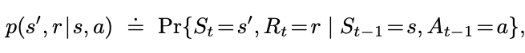

# Chapter 3: Finite Markov Decision Processes
> 

## Some basic notes
MDPs:
* learner + decision maker = agent
* everything else = environment 
* SARSA: State Action Reward State Action
* function *p* defines the dynamics of an MDP - the probability of values occuring at time *t* given the previous state-action pair *s* and *a*
* MDPs are only dependent on the previous SA pair, nothing before that. one step behind only.

p specifies a probability distribution for each choice of *s* and *a*, that is, 

### from the four-argument dynamics function *p*, one can compute anything else one might want to know about the environment
you can find the state transition probabilities:
$$p(s'|s,a) \doteq \text{Pr}\{S_t = s' | S_{t-1} = s, A_{t-1} = a\} = \sum_{r \in \mathcal{R}} p(s',r|s,a).$$

expected rewards for SA pairs via r: S x A -> R:
$$r(s,a) \doteq \mathbb{E}[R_t | S_{t-1}=s, A_{t-1}=a] = \sum_{r\in\mathcal{R}} r \sum_{s'\in\mathcal{S}} p(s',r|s,a),$$

expected rewards for SAS triples as r: S x A x R:
$$r(s,a,s') \doteq \mathbb{E}[R_t | S_{t-1}=s, A_{t-1}=a, S_t = s'] = \sum_{r\in\mathcal{R}} r \frac{p(s',r|s,a)}{p(s'|s,a)}.$$

Usually the four-argument *p* function is used but these have their value too.

