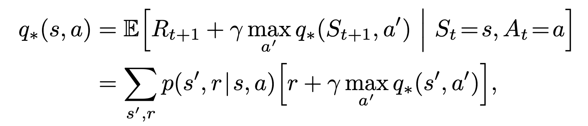
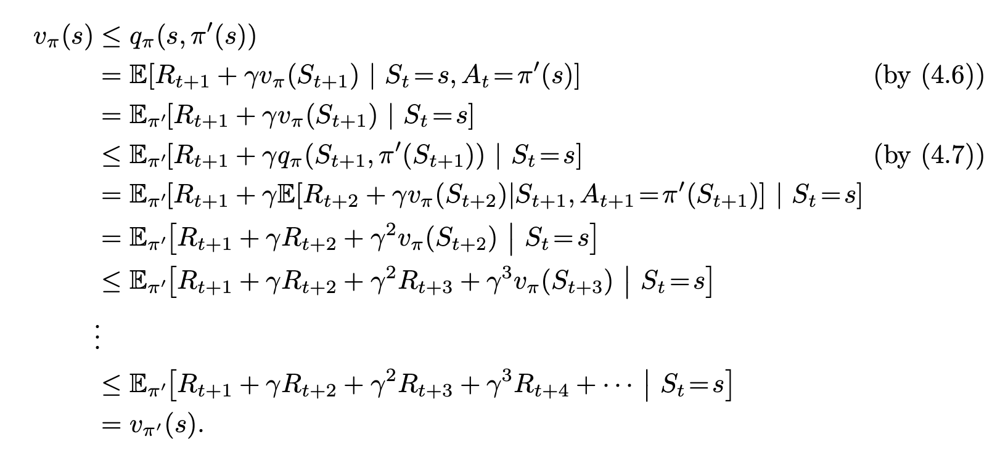
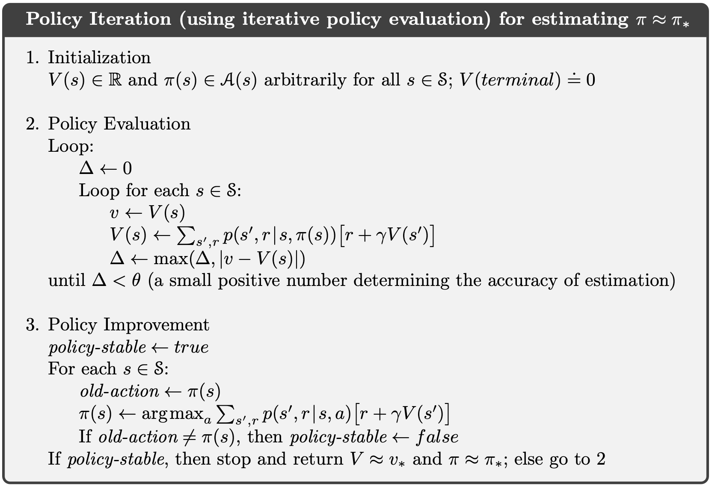
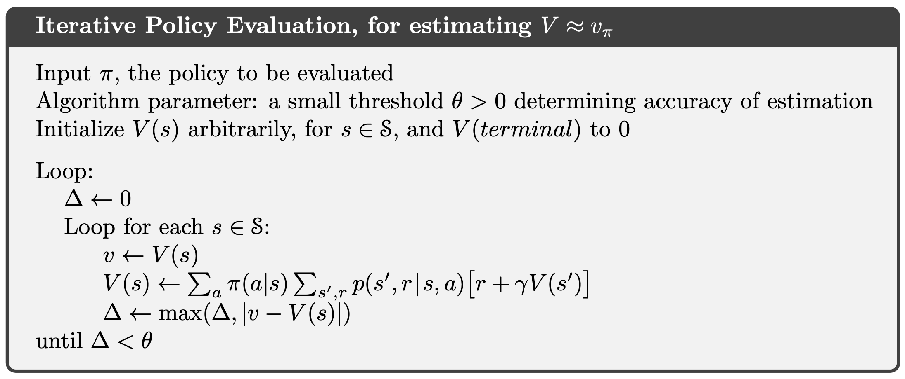
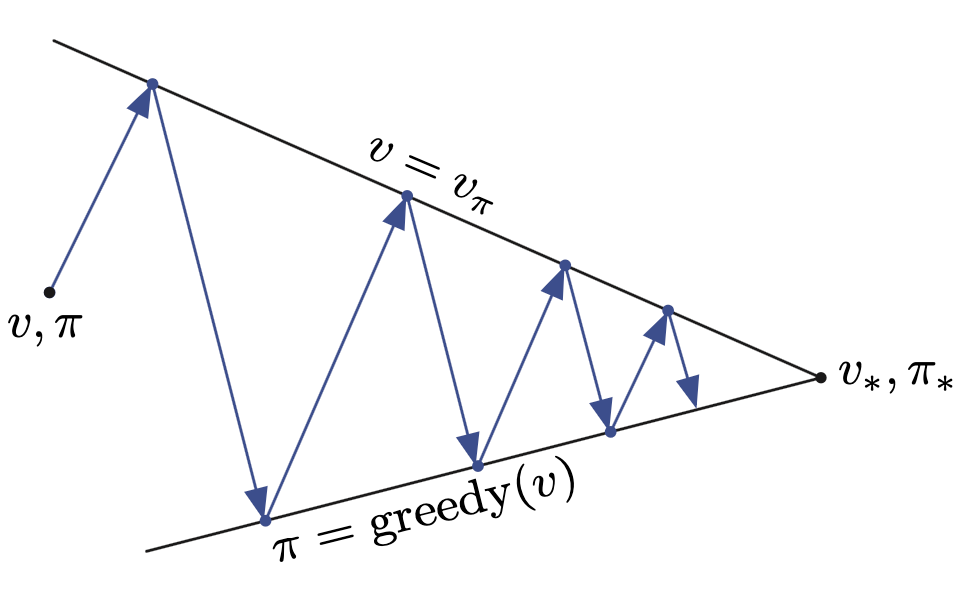

# Chapter 4: Dynamic Programming
> The key idea of DP, and of reinforcement learning generally, is the use of value functions to organize and structure the search for good policies. 

* DP refers to a collection of algorithms that can be used to compute optimal policies given a perfect model of the environment as an MDP
* Starting with this chapter all environments are by default finite MDPs (SAR finite, dynamics given by a set of probabilities p(s', r|s, a))

## Policy Evaluation
$v_\pi(s)$ is given by the bellman equation.
* it represents the expected reward when taking a specific action
* it estimates the expected cumulative (often discounted) reward from being in a state s and following the current policy thereafter.

the policy is the probabilty of taking step a at state s
* you want to maximize the culmulative reward
* so it's almost like next-token prediction

### value iteration:
1. You start with an arbitrary policy and a **value function**
2. repeatedly update the value function with the bellman equation until it converges

value function is specific to policy

you keep predicting the next step(s) until the difference (loss) is very low.

gradient descent here

### policy iteration:
1. start with an arbitrary policy
2. compute the value function of the current policy π
3. generate a new policy that's greedy WRT the value function
4. repeat until the new policy = policy

gradient ascent because you want to maximize reward, rather than minimize loss

All the updates done in DP algorithms are called expected updates because they are based on an expectation over all possible next states rather than on a sample next state.

## Asynchrounous Dynamic Policy
> A major drawback to the DP methods that we have discussed so far is that they involve operations over the entire state set of the MDP, that is, they require sweeps of the state set.

Making them asynchronous allows for state-specific updates, using whatever values are available.
* this doesn't mean that the number of computations decrease, just that it won't get locked
* this also means it can be parallelized and that the updates can happen as the policy interacts with the environment (as it is experiencing the MDP), which means continuous learning can happen

## Generalized Policy Iteration
Policy iteration consists of two simultaneous processes: 
1. Making the value function consistent with the current policy
2. Improving the current policy (see my [DQN code](https://github.com/tsuiusi/papers/tree/main/dqn))

The goal is to converge on an *optimal policy* and an *optimal value function*. 

## Efficiency of DP
* Faster than direct search
* Thought limited because of curse of dimensionality (power law scaling) but it's better than directly/linearly searching (async)
* Used to solve MDPs, quite frequently

Asynchronous DP methods are in-place iterative methods that update states in an arbitrary order, perhaps stochastically determined and using out-of-date information.

> "All of them update estimates of the values of states based on estimates of the values of successor states. That is, they update estimates on the basis of other estimates. We call this general idea bootstrapping."

