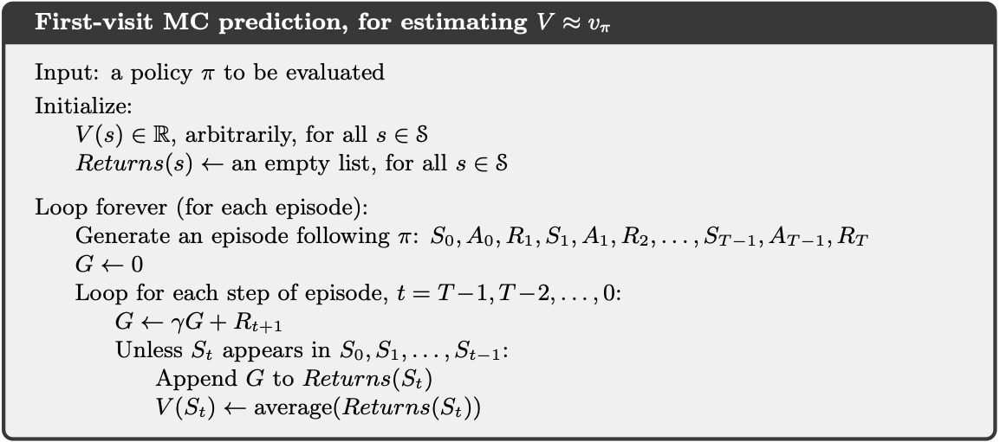
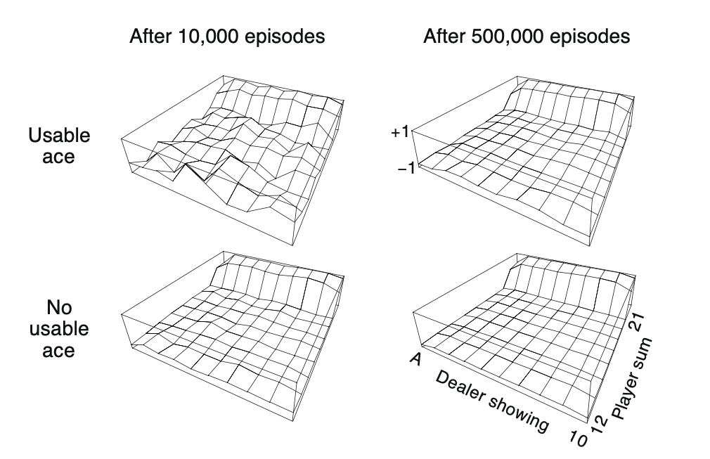

# Chapter 5: Monte Carlo Methods
> Looking through the whole trajectory and estimating value based on the sample returns

DP generally considers the environment to be known, which is quite unrealistic. Agents aren't omniscient. This brings us to the topic of HMMs and HHMMs, but we're gonna talk about those later (not in the book yet)

Bandit methods sample and averages rewards, Monte-Carlo methods averages *returns* for each SA pair:
* MC methods only require experience - (state, action, reward, next\_state) samples from interacting with the actual environment
* The model's role is to generate transitions (see the comment about DQN code in chapter4.md)

## Monte Carlo Prediction
Each occurence of state s in an episode is a *visit* to state s. Since s can be visited more than once, two methods are immediately apparent:
1. First visit MC: averages $v_\{pi}$ as the average of returns following first visits to s
2. Every visit MC: averages $v_\{pi}$ as the average of returns following all visits to s

Both methods converge to $v_\{pi}$ as the number of visits to s tends to infinity.
### Blackjack example
* The game is an episodic finite MDP
* All rewards are +1, -1, 0
* Actions are to hit/stick
* States depend on the cards and the dealer's shown card
* Ace is always counted as 11

The player therefore makes decisions based on 3 variables: the current sum (12-21), dealer's showing card, and whether he has a holdable ace or not. So there are 200 states.

Consider the policy that hits only if the player's sum is <20.

(the picture describes the rest of what happens if you play a lot with this policy)

However, given the number of states, it's not feasible to use DP methods to optimally play blackjack:
* All the probabilities have to be calculated beforehand
* Computations are error prone

So we use Monte Carlo methods. We can generalize the idea of backup diagrams (the trees in DP showing all the probabilities, if you were wondering).

The MC diagram only shows the actions sampled and go all the way to the end of the episode (termination), as opposed to all actions and one-step transitions in DP.
* It doesn't bootstrap (iterate before finishing)
* The computational cost of estimating a value for a state is independent of the total no. states
* However, MC can only be used on episodic MDPs (must terminate)

## Notes from David Silver
### MC methods
* Good convergence
* Takes longer
* Always finds the solution that minimizes MSE
* Better in non-markov situations (POMDP)

Value updates are basically:
1. Computing predicted return (for the whole trajectory) 
2. Gradient descenting with the error (difference between actual return and predicted return

Policy updates are:
1. 

### Temporal difference methods
* Can learn from incomplete episodes
* Basically the same thing, but broken up into smaller chunks (transitions vs episodes)
* Bootstrapping - learning per turn/per shorter chunk
* Works for non-terminating episodes (e.g stock markets)
* Not averaged; lowe variance but higher bias
* More efficient 

It's closer to the bellman equation than MC methods - the focus is on V(S\_t+1)
> He raises the example that in MC methods you wouldn't know if you nearly died but in TD methods close calls return negative rewards

TD lambda is when you do TD learning but weigh every successive transition with lambda so they're weighted less and less. 
> This is getting even closer to the Bellman
* If we hit a terminating node and it loops 0 over and over again this would be affected way less than TD or MC
* It's the balancing between MC and TD 
* TD(1) = MC
* Sum of offline updates is same for forward and backwards view

### Overfitting both to a set of sample data
* TD fits to the actual solution whereas MC fits to the solution described by the training data (final value is the real final value)
* TD is more accurate because it **exploits the markov property** (closed system, stochastic process, determined only by the previous)

 TD looks at oe transition, MC looks at whole trajectory, DP looks at all the available single step transitions.

 Online vs offline learning: updating during episode vs batching to the end
