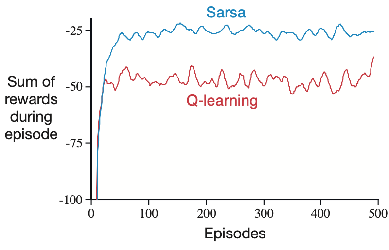

# Temporal Difference Learning
> covered in chapter 5 notes
## SARSA and Q Learning
* On policy: learns about and improves the same policy that it's using to make decisions.
* Off policy: target policy may be different to behaviour policy

### SARSA
> State Action Reward State Action
* On policy - updates q values based on the action actually taken
* Q(s,a) ← Q(s,a) + α[r + γQ(s',a') - Q(s,a)]
* Considers exploration

### Q Learning
* Off policy - updates q values based on best possible action, evaluated 
* Q(s,a) ← Q(s,a) + α[r + γ max(Q(s',a')) - Q(s,a)]
* Goes straight for the optimal

> Maximization bias: the maximum over estimated values is used implicitly as an estimate of the maximum value, significant bias (especially in on-policy Q learning)

### Double Q learning
* Converges to optimum much faster
* Avoids maximization bias because they're updating each other, not themselves

