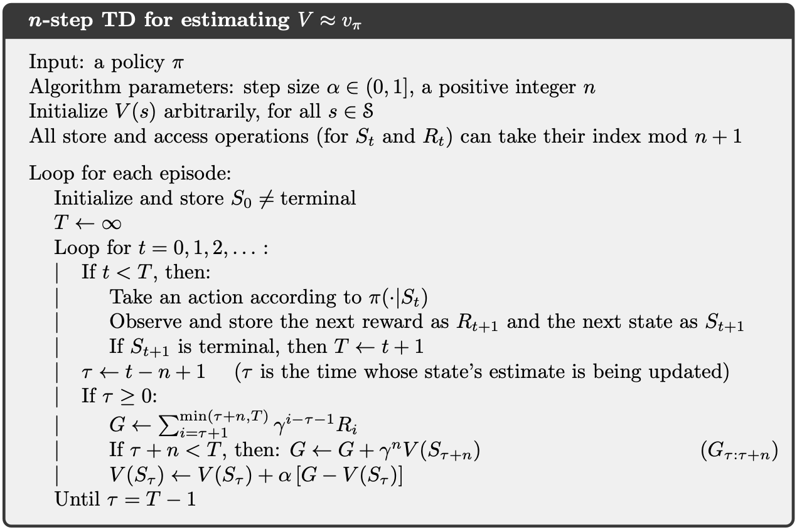
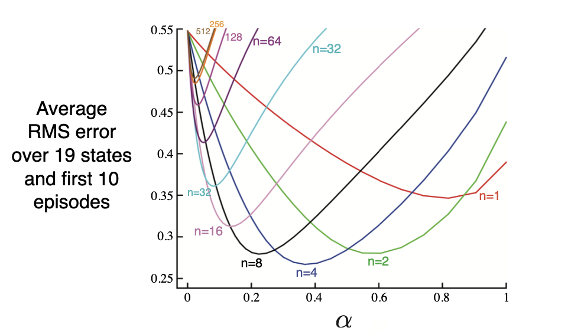
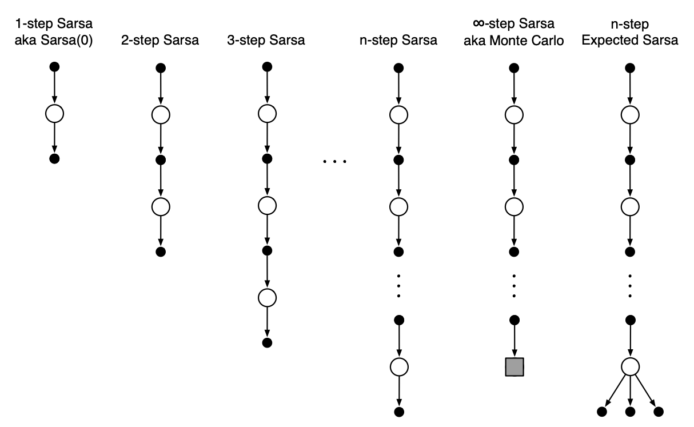
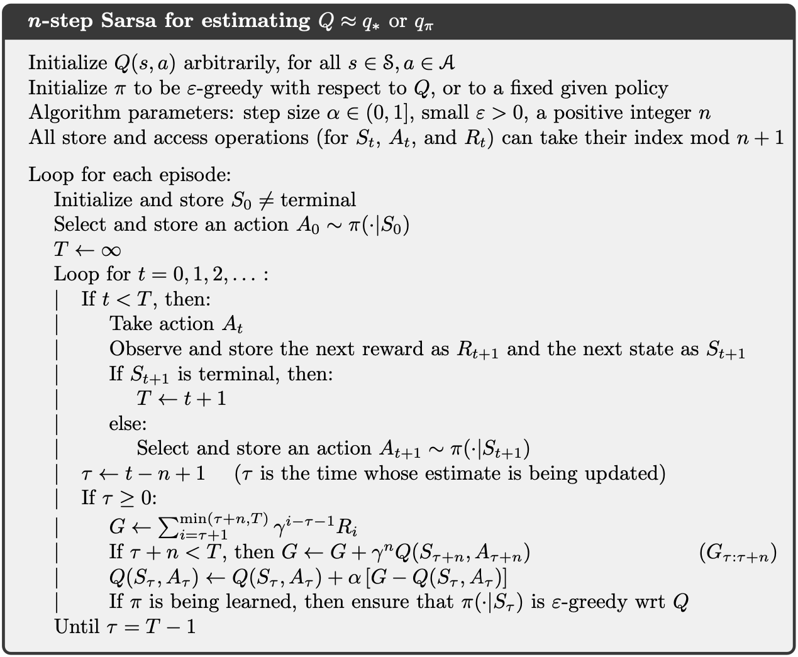
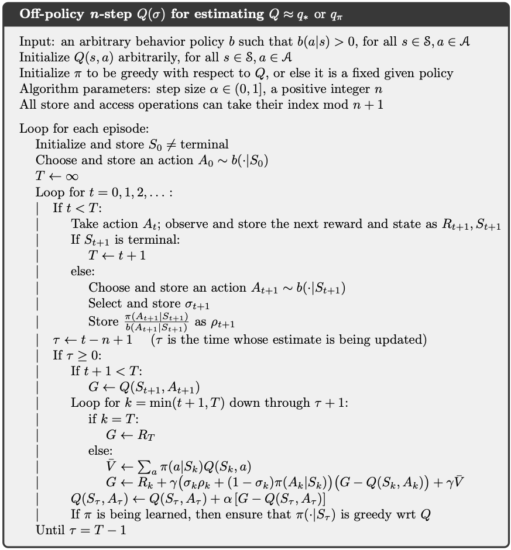

# Chapter 7: n-step learning
> kinda also explained in chapter 5, you predict n steps ahead. whether you scale/weight decay is up to you.

Eligibility traces: temporary record of the occurrence of an event, such as visiting a state or taking an action (so transitions)

## n-step TD Prediction
(already explained, this is TD but instead of updating step-by-step you update n-step by n-step)
* Rewards are summed with a gamma scale factor that decays the weighting of future rewards
* G represents reward sum btw
* There's an optimum *n* somewhere between MC and TD learning

## n-step SARSA
* Does the same thing with looking at future returns/rewards
* Uses the Q value of the state *n* steps ahead
* SARSA predicts the return of an SA pair, and learns the Q-values, Q(s,a), which represent the expected sum of future rewards when taking action 'a' in state 's'
* Q value up to nth step

## n-step Off-policy Learning
> Recall that o↵-policy learning is learning the value function for one policy, ⇡, while following another policy, b.
* Q learning is off-policy because it uses a value network and a policy network and you keep updating in the direction of the max Q value
* Q(s,a) ← Q(s,a) + α[r + γ max\_a' Q(s',a') - Q(s,a)]

