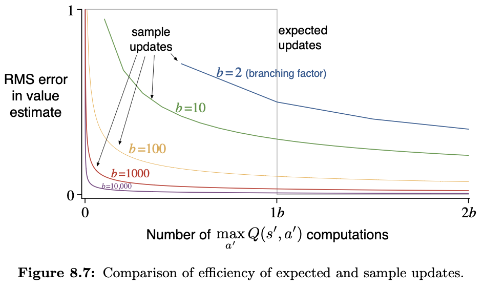
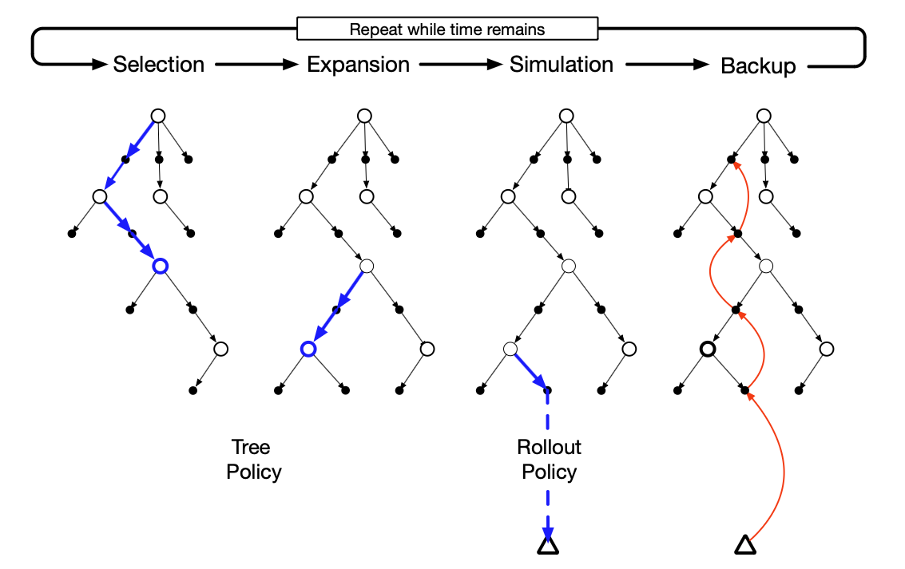
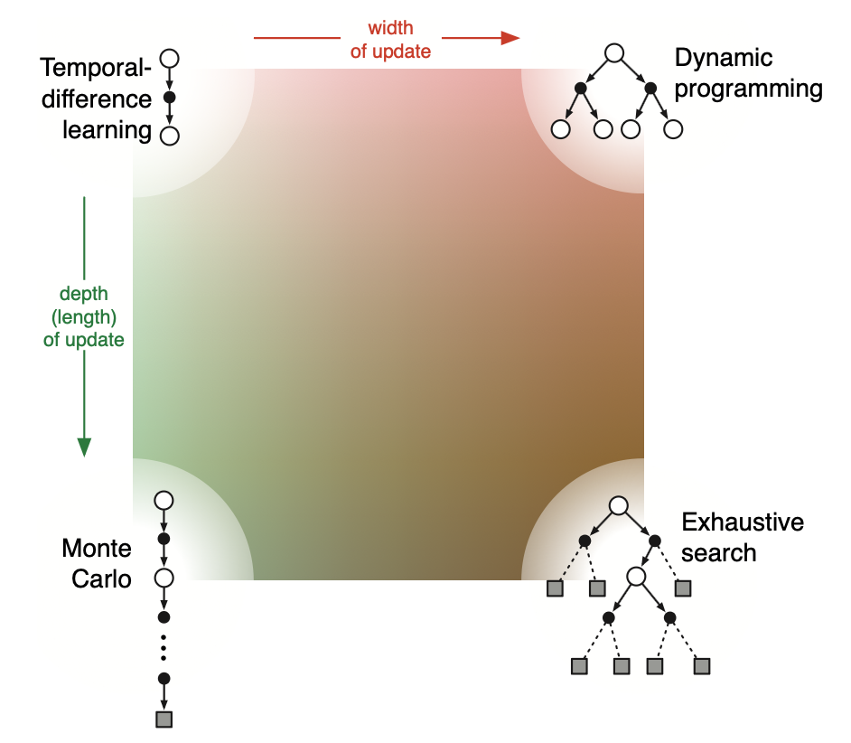

# Chapter 8: Planning and Learning with Tabular Methods
> 

### Definitions
* Model: anything an agent can use to predict how the environment will respond to its actions
    * Can be distribution based or sample based; much easier to obtain sample-based (less values needed ot be predicted)
    * Distribution: all possible sums of everything and the probabilities of occurence
    * Sample: individual prediction of what's going to happen
    * Used to simulate the environment and produce simulated experience
* Planning: any computational process that takes a model as an input and produces/improves a policy for interacting with the modeled environment
$$
\require{tikz-cd}
\begin{tikzcd}
\text{model} \arrow[r, "\text{planning}"] & \text{policy}
\end{tikzcd}
$$
    * State-space planning: search through state space for an optimal policy/path to a goal (in other words, looking through all the possible states and choosing the policy/path through them that maximizes return)
    * Plan-space planning: search through action space for an optimal sequence of actions that maximizes returns/achieves a certain state
        * Annoying, ignored and not considered further

### Two basic ideas
1. All state-space planning methods involve computing value funcitons as an intermediate step to improve the policy
2. They compute value functions by updates or backup operations applied to simulated experience (e.g experience replay)

$$
\require{tikz-cd}
\begin{tikzcd}
\text{model} \arrow[r] & \text{simulated experience} \arrow[r, "\text{backups}"] & \text{values} \arrow[r] & \text{policy}
\end{tikzcd}
$$

> "The heart of both learning and planning methods is the estimation of value functions by backing-up update operations."

## Dyna: Integrated Planning, Acting, and Learning (a toy policy for learning)
* Learning directly and changing the model as it learns may interact with planning. 
* In a planning agent, there's two types of learning: model learning and direct RL
    * Indirect (influencing the model, not the policy) learning is better for using limited interactions
    * Direct methods are much simpler, isn't influenced by biases of the model

The toy architecture:

The toy algorithm:

Not very interested in writing notes for this.

## When the Model is Wrong
> What if your understanding of the world is fundamentally wrong? Epsilon greedy methods.
* The longer a state hasn't been tested, the more likely its dynamics have changed and making the model potentially wrong
    * In Stardew Valley, it's not profitable to farm in Winter because you can only grow foragables and in the greenhouse (no Ginger Island btw); if you only learned that 'farming isn't profitable' and not the concept of seasons then you'll miss a lot of profit in Spring, Summer, or Fall.
* Encouraging behavior that tests long-untried actions is good, bonus reward involving these actions

## Prioritized Sweeping
* Planning can be much more efficient if simulated transitions and updates are focused on specific SA pairs
    * Moves are not equal. Some moves are better than others.
    * Like openings in chess. ICBM.
> “In order to improve your game, you must study the endgame before everything else. For whereas the endings can be studied and mastered by themselves, the middle game and opening must be studied in relation to the end game.”
* Backward focusing: working from the goal state and working backwards
    * Useful when a state is discovered to have changed and you need to edit your policy
    * Awfully like backpropagation

In a stochastic environment (random env), variations in estimated transition probabilities affect the size of changes and urgency. We use this to rank their urgencies, and perform them in order of priority. That's the key idea behind prioritized sweeping. You prioritize updates.

## Expected vs Sample Updates

Expected update for a SA pair:
$$Q(s, a) \leftarrow \sum_{s',r} \hat{p}(s', r|s, a) \left[r + \gamma \max_{a'} Q(s', a')\right]$$

Corresponding sample update for the SA given the sample next state and reward:
$$Q(s,a) \leftarrow Q(s,a) + \alpha \left[R + \gamma \max_{a'} Q(S',a') - Q(s,a)\right],$$

The difference is that when the environment is stochastic, there are a few possible next states whereas when you're given the state, then the expected state is identical to the sample state. 
* Sample update impacted by sampling error, but cheaper because it only considers one next state
* For a branching factor *b* the expected update is *b* times more expensive than sample updates
* Next state is the next state produced after the current SA pair

> so it updates the 'value' of the current state based on the discounted future return of that one transition, and does it a lot of times to average the value

## Trajectory Sampling
> Updating the entire state space once per sweep/sampling uniformly to see which ones to update/dampling based on the current policy

Basically it's better to sample from actual trajectories because then you wouldn't play random moves like the bongcloud attack.

## Real Time DP
Same idea - most states are irrelevant, you want to explore start states and relevant states. RTDP is on-policy trajectory sampling version of DP.

## Planning at Decision Time
Planning while encountering new states, and finishing after the encounter

## Heuristic Search
State space planning methods using domain-specific knowledge to guide search.
* Heuristic function estimates the cost/distance to goal state
* Extension of greedy search past a single step

## Rollout Algorithms
Estimates action values for a given policy by averaging the returns of many simulated trajectories that start with each possible action then follow the given policy.

Basically predicting the whole trajectory via the policy -> simulating the states -> evaluating the simulated trajectory

The rollout algorithm produces MC estimates of action values only for the current state and some single-use policy (rollout policy), and the goal is to improve the rollout policy, not find the optimal policy. 

Every trial is independent of one another. I think the point of this is just to play so many times you get the benefit of exploring most of the space while not having to DP-style branch everything.
> We do not ordinarily think of rollout algorithms as learning algorithms because they do not maintain long-term memories of values or policies.

## MCTS
> What everyone wants to see
> The core idea of MCTS is to successively focus multiple simulations starting at the current state by extending the initial portion of trajectories that have received high evaluations from earlier simulations
* It's taking the paths that work well, and going through the possibilities from there
* Some nodes are better than others
* Incrementally exttends the tree by adding nodes representing promising states based on simulated trajectories
    * So an elitist tree-creation policy (tree policy) balances exploration and exploitation
    * Upper confidence bound

> "At its base, MCTS is a decision-time planning algorithm based on Monte Carlo control applied to simulations that start from the root state; that is, it is a kind of rollout algorithm as described in the previous section. It therefore benefits from online, incremental, sample-based value estimation and policy improvement."

PART ONE OF THE BOOK IS DONE.
1. Seek to estimate value functions
2. Backing up states along actual/predicted trajectories
3. All use general policy iteration (GPI) to get smarter

# David Silver Episode 6: Value Function Approximation
1. Approximate return from state
2. Approximate return from SA pair
3. Take a state, return returns of every next SA pair

ALL OF MACHINE LEARNING IS A FUNCTION APPROXIMATOR
* Feature combinations
* NNs
* Decision trees
* Fourier
* Nearest neighbors

The first two are differentiable (backprop) so they're more easily adjustable, and you can change them and make them better.

## Experience Replay with DQN
* Plays a lot, stores transition in a replay buffer
* Goes through the randomly created batch, optimizes Q-network and Q-learning targets

see my code
