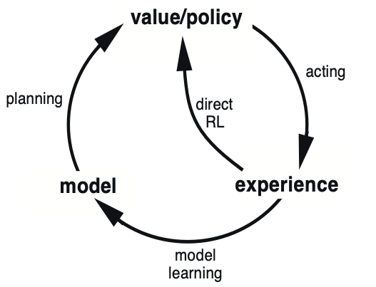
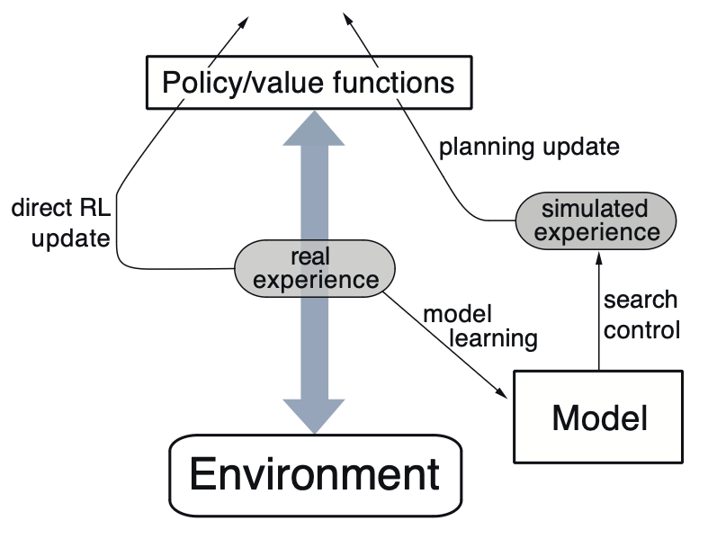
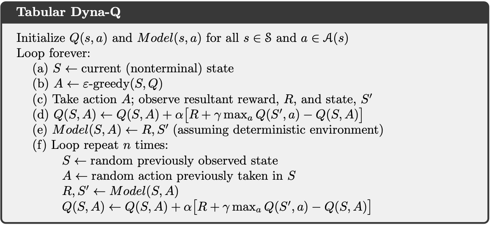
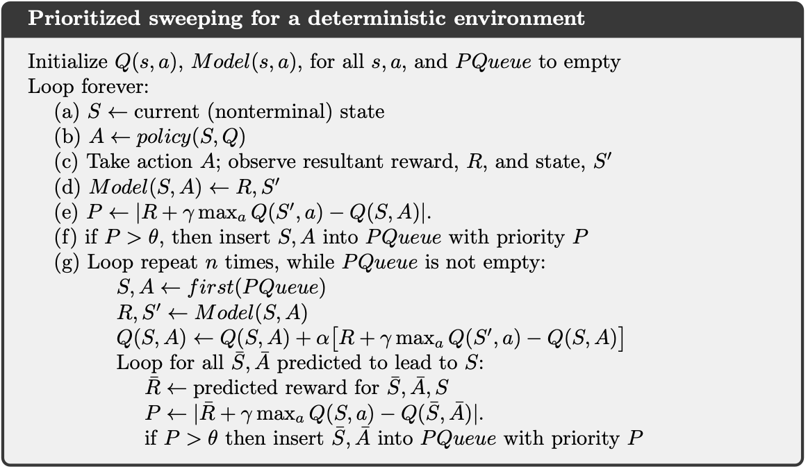
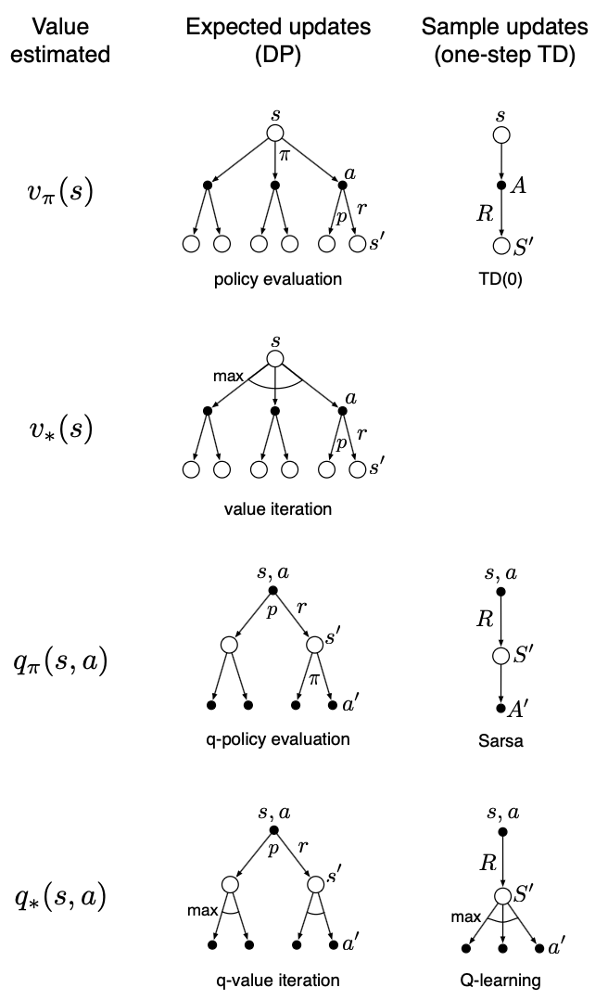

# Chapter 8: Planning and Learning with Tabular Methods
> 

### Definitions
* Model: anything an agent can use to predict how the environment will respond to its actions
    * Can be distribution based or sample based; much easier to obtain sample-based (less values needed ot be predicted)
    * Distribution: all possible sums of everything and the probabilities of occurence
    * Sample: individual prediction of what's going to happen
    * Used to simulate the environment and produce simulated experience
* Planning: any computational process that takes a model as an input and produces/improves a policy for interacting with the modeled environment
$$
\require{tikz-cd}
\begin{tikzcd}
\text{model} \arrow[r, "\text{planning}"] & \text{policy}
\end{tikzcd}
$$
    * State-space planning: search through state space for an optimal policy/path to a goal (in other words, looking through all the possible states and choosing the policy/path through them that maximizes return)
    * Plan-space planning: search through action space for an optimal sequence of actions that maximizes returns/achieves a certain state
        * Annoying, ignored and not considered further

### Two basic ideas
1. All state-space planning methods involve computing value funcitons as an intermediate step to improve the policy
2. They compute value functions by updates or backup operations applied to simulated experience (e.g experience replay)

$$
\require{tikz-cd}
\begin{tikzcd}
\text{model} \arrow[r] & \text{simulated experience} \arrow[r, "\text{backups}"] & \text{values} \arrow[r] & \text{policy}
\end{tikzcd}
$$

> "The heart of both learning and planning methods is the estimation of value functions by backing-up update operations."

## Dyna: Integrated Planning, Acting, and Learning (a toy policy for learning)
* Learning directly and changing the model as it learns may interact with planning. 
* In a planning agent, there's two types of learning: model learning and direct RL
    * Indirect (influencing the model, not the policy) learning is better for using limited interactions
    * Direct methods are much simpler, isn't influenced by biases of the model

The toy architecture:

The toy algorithm:

Not very interested in writing notes for this.

## When the Model is Wrong
> What if your understanding of the world is fundamentally wrong? Epsilon greedy methods.
* The longer a state hasn't been tested, the more likely its dynamics have changed and making the model potentially wrong
    * In Stardew Valley, it's not profitable to farm in Winter because you can only grow foragables and in the greenhouse (no Ginger Island btw); if you only learned that 'farming isn't profitable' and not the concept of seasons then you'll miss a lot of profit in Spring, Summer, or Fall.
* Encouraging behavior that tests long-untried actions is good, bonus reward involving these actions

## Prioritized Sweeping
* Planning can be much more efficient if simulated transitions and updates are focused on specific SA pairs
    * Moves are not equal. Some moves are better than others.
    * Like openings in chess. ICBM.
> “In order to improve your game, you must study the endgame before everything else. For whereas the endings can be studied and mastered by themselves, the middle game and opening must be studied in relation to the end game.”
* Backward focusing: working from the goal state and working backwards
    * Useful when a state is discovered to have changed and you need to edit your policy
    * Awfully like backpropagation

In a stochastic environment (random env), variations in estimated transition probabilities affect the size of changes and urgency. We use this to rank their urgencies, and perform them in order of priority. That's the key idea behind prioritized sweeping. You prioritize updates.

## Expected vs Sample Updates
$Q(s, a) \leftarrow \sum_{s',r} \hat{p}(s', r|s, a) \left[r + \gamma \max_{a'} Q(s', a')\right]$

I'm cooked bro
