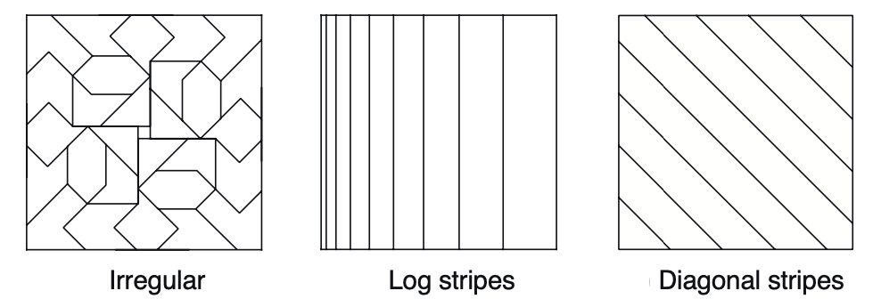

# Part II: Approximate Solution Methods
* In part 1 the methods are applied to problems with arbitrarily large state spaces; impossible to find optimal value function/policy 
* Goal is to find a good approximate
* You need to generalize from experience - generalization is key

# Chapter 9: On-policy Prediction with Approximation
* Using RL to approximate functions
* Parameters are represented as weight vectors
* No. weights is typically less than the space

## Prediction Objective
> Loss functions - MSE, MAE, etc; if the model is distribution based, KL divergence
This section just covers basic ML topics

## SG and semi-gradient methods
> SGD, gradient descent, how to actually get better

Bootstrapping methods are semi-gradient methods since they don't incorporate the whole gradient - they use the effect of changing the weights on the estimate, but not the target.

Again, weight updates are performed as gradient steps and n-step reward is approximated/predicted via sum of discounted returns.

## Feature construction
Building features for inputs and outputs (e.g wasd output, screen input; but the features might get combined (like WHC))

### Fourier basis
* Fourier series: expresses periodic functions as a sum of sine/cosine basis functions of different frequencies
* For a period t you can use it to approximate any feature? 
* Works better than using polynomials
* It's just *a* way to get features, depending on the input i guess? like ECG or something for example?
* would be interesting to code a blind-man's vision model

### Coarse coding
* Continuous representation 
* A bunch of sets
* Encoding actions?
* Generalization is determined by shape and size of features' receptive fields
* Width is kinda like step size; it'll adjust by that much every step and thus there's an optimum width

They also bring up convolutions and etc so yk, those can be features too. (tiling and it's not always regular, you get these weird origami shapes too)

### Radial basis functions
Gaussians

## Choosing hyperparameters
step_size = (period * expected value[x^T x])^-1

(activation functions section next, skip) (woo LeNet woo convnets wooo)

## Least Squares TD
A linear function approximation method that is quite good?

completely unrelated but if you could get data from/of everything it would be really useful. like chinese people with perfect pitch vs americans or whatever, and then look at the data of upbringing and whatnot

## memory based and kernel based as well:
so basically all methods used in popular ML is parameter based - you update the parameters based on the gradient.

memory based saves training examples in memory as arrived and whenever the query's state value is needed, the estimate is provided by the memory.
* so less encoding information and more RAG type
* not efficient
* advantage of not being limited by functional forms
* KNN and search algorithms become useful here

kernel based means using kernels (like in conv)
* weighted average of everything
* expresses how relevant a state is to another state - relational 
* regression is like linear parametric method
* common kernel is gaussian radial basis function (RBF), used in conjunction with memory based methods
* kernel trick is used to work in higher dimensions when you're just working with a stored set of examples

# what is the kernel trick

# David Silver Lecture 7: Policy Gradients
> Model free learning

Value based RL:
* Epsilon greedy
* Learnt value function

Policy based:
* No value function 
* Learnt policy
* Advantages: better convergence, more effective in higher dimensional/continuous spaces, can learn stochastic policies
* Disadvantages: typically converges to local optimum, evaluating a policy is inefficient + high variance
* In the aliased gridworld example he shows how having a policy that randomly picks an action is better than a greedy policy that can't differentiate between states (identical states)

Actor-critic:
* Both VF and policy are learnt

## Policy Objective Functions
* Goal: given policy π(s, a) with parameters theta, find best theta
* To measure the quality of the policy, you can use:
    * Start state
    * Average value
    * Average reward per timestep
    * Stationary distribution of Markov chain for π_theta
* So this basically quantifies the return/how good a policy is. Like a value function, but not exactly? Check later.

## Policy Optimization
> Policy based RL is an optimization problem - find the parameters that maximize the return/value
|Non-Gradient|Gradient|
|-|-|
|Hill climbing|Gradient descent|
|Simplex/amoeba/Nelder Mead|Conjugate gradient|
|Genetic algorithms|Quasi-newton|

Gradient descent is cool, so we use that. And we use sequential structure to breakdown optimization to non-MC methods.

## Policy Gradient
> Karpathy's favorite
* Let J(theta) be any policy objective function
* Policy gradient algorithms search for a local maximum in J(theta) by ascending the gradient of the policy WRT parameters theta $$\Delta\theta = \alpha\nabla_{\theta}J(\theta)$$

### Score function
* Assume policy is differentiable whenever it's non-zero and we know the gradient $\nabla_{\theta}\pi_{\theta}(s, a)$
* Likelihood ratios exploit the following identity
$$\nabla_{\theta}\pi_{\theta}(s, a) = \pi_{\theta}(s, a)\frac{\nabla_{\theta}\pi_{\theta}(s, a)}{\pi_{\theta}(s, a)} = \pi_{\theta}\nabla_{\theta}log\pi_{\theta}(s, a)$$
* Score function is $\nabla_{\theta}log\pi{\theta}(s, a)$
* Gradient policy = gradient of log of policy
* Score function is gradient of log-likelihood, which you want to maximize (in this case, otherwise you want to minimize)
* The point of rewriting the gradient into the identity is so you can evaluate and take advantage of the log (so you can perform gradient ascent)

### Example: softmax policy
* Weight is a linear combination of the features 
* Probability is proportional to exponentiated weight
* Score function is predicted - expected
$$\nabla_{\theta}log\pi_{\theta}(s, a) = \fi(s, a) - \E_{\pi_{theta}}[\fi(s, .)]

(there's also a gaussian policy)

Model free: take an action, compute the gradient via the policy, and multiply it by the reward - you don't use the model
* Model doesn't mean ML model, but world model
* Like it doesn't need the MDP - it learns from the interactions with the world and experience 

### MC PG (REINFORCE)
* Update params via SGA
* At each episode, update parameters with the scaled score

### Action Value Action Critic
* Actor critic algorithm based on action-value critic
* Critic updates w via linear TD
* Actor updates theta via policy gradient
* Same idea as before, there's an optimal between single-step TD and MC methods
